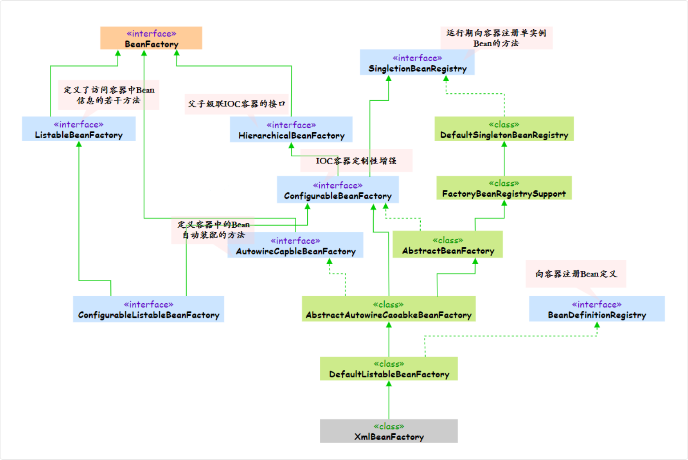

## IOC

### BeanFactory和ApplicantContext的区别

控制反转就是把创建和管理 bean 的过程转移给了第三方。而这个第三方，就是 Spring IoC Container，对于 IoC 来说，最重要的就是容器。

通俗点讲，因为项目中每次创建对象是很麻烦的，所以我们使用 Spring IoC 容器来管理这些对象，需要的时候你就直接用，不用管它是怎么来的、什么时候要销毁，只管用就好了。

> 容器是 IoC 最重要的部分，那么 Spring 如何设计容器的

使用 `ApplicationContext`，它是 `BeanFactory` 的子类，更好的补充并实现了 `BeanFactory`

BeanFactory 简单粗暴，可以理解为 HashMap：

- Key - bean name
- Value - bean object

但它一般只有 get, put 两个功能，所以称之为“低级容器”

BeanFactory 提供了最基本的 IoC 能力。

它就像是一个 Bean 工厂，负责 Bean 的创建和管理, 他采用的是懒加载的方式，也就是说只有当我们真正去获取某个 Bean 的时候，它才会去创建这个 Bean

它最主要的方法就是 `getBean()`，负责从容器中返回特定名称或者类型的 Bean 实例

```java
public class BeanFactoryExample {
  public static void main(String[] args) {
    // 创建 BeanFactory
    DefaultListableBeanFactory beanFactory = new DefaultListableBeanFactory();
    
    // 手动注册 Bean 定义
    BeanDefinition beanDefinition = new RootBeanDefinition(UserService.class);
    beanFactory.registerBeanDefinition("userService", beanDefinition);
    
    // 懒加载：此时才创建 Bean 实例
    UserService userService = beanFactory.getBean("userService", UserService.class);
  }
}
```

而 `ApplicationContext` 多了很多功能，因为它继承了多个接口，可称之为“高级容器”

`ApplicationContext` 是 `BeanFactory` 的子接口，在 `BeanFactory` 的基础上扩展了很多企业级的功能。它不仅包含了 `BeanFactory` 的所有功能，还提供了国际化支持、事件发布机制、AOP、JDBC、ORM 框架集成等等



从使用场景来说，实际开发中用得最多的是 `ApplicationContext`

像 `AnnotationConfigApplicationContext`、`WebApplicationContext` 这些都是 `ApplicationContext` 的实现类

另外一个重要的区别是生命周期管理。ApplicationContext 会自动调用 Bean 的初始化和销毁方法，而 BeanFactory 需要我们手动管理

### 手写一个简单 IOC 容器

首先定义基础的注解，比如说 `@Component`、`@Autowired`等

```java
// 组件注解
@Target(ElementType.TYPE)
@Retention(RetentionPolicy.RUNTIME)
public @interface Component {
}

// 自动注入注解
@Target(ElementType.FIELD)
@Retention(RetentionPolicy.RUNTIME)
public @interface Autowired {
}
```

其次，核心的 IoC 容器类，负责扫描包路径，创建 Bean 实例，并处理依赖注入

```java
public class SimpleIoC {
  // Bean容器
  private Map<Class<?>, Object> beans = new HashMap<>();
  
  /**
   * 注册Bean
   */
  public void registerBean(Class<?> clazz) {
    try {
      // 创建实例
      // 获取该类的无参构造方法，然后创建一个实例
      Object instance = clazz.getDeclaredConstructor().newInstance();
      beans.put(clazz, instance);
    } catch (Exception e) {
      throw new RuntimeException("创建Bean失败: " + clazz.getName(), e);
    }
  }
    
  /**
   * 获取Bean
   */
  @SuppressWarnings("unchecked")
  public <T> T getBean(Class<T> clazz) {
    return (T) beans.get(clazz);
  }
    
  /**
   * 依赖注入
   */
  public void inject() {
    for (Object bean : beans.values()) {
      injectFields(bean);
    }
  }
    
  /**
   * 字段注入
   */
  private void injectFields(Object bean) {
    // 获取属性
    // getDeclaredFields() 获取该类自己声明的所有字段（不含父类）
    // 包括 private 字段，所以后面需要 setAccessible(true)
    Field[] fields = bean.getClass().getDeclaredFields();
    for (Field field : fields) {
      // 判断字段有没有 @Autowired
      if (field.isAnnotationPresent(Autowired.class)) {
        try {
          field.setAccessible(true);
          Object dependency = getBean(field.getType());
          // 反射注入
          field.set(bean, dependency);
        } catch (Exception e) {
          throw new RuntimeException("注入失败: " + field.getName(), e);
        }
      }
    }
  }
}
```

使用示例，定义一些 Bean 类，并注册到 IoC 容器中

```java
// DAO层
@Component
class UserDao {
  public void save(String user) {
    System.out.println("保存用户: " + user);
  }
}

// Service层
@Component
class UserService {
  @Autowired
  private UserDao userDao;
  
  public void createUser(String name) {
    userDao.save(name);
    System.out.println("用户创建完成");
  }
}

// 测试
public class Test {
  public static void main(String[] args) {
    SimpleIoC ioc = new SimpleIoC();
    
    // 注册Bean
    ioc.registerBean(UserDao.class);
    ioc.registerBean(UserService.class);
    
    // 依赖注入
    ioc.inject();
    
    // 使用
    UserService userService = ioc.getBean(UserService.class);
    userService.createUser("PP");
  }
}
```

#### 扫描版本

```java
import java.lang.reflect.Field;
import java.util.*;

public class SimpleIoC {
  private Map<Class<?>, Object> beans = new HashMap<>();
    
  /**
   * 扫描并注册组件
   */
  public void scan(String packageName) {
    // 简化版：手动添加需要扫描的类
    List<Class<?>> classes = getClassesInPackage(packageName);
    
    for (Class<?> clazz : classes) {
      if (clazz.isAnnotationPresent(Component.class)) {
        registerBean(clazz);
      }
    }
    
    // 依赖注入
    inject();
  }
    
  /**
   * 获取包下的类（简化实现）
   */
  private List<Class<?>> getClassesInPackage(String packageName) {
    // 面试时可以说："实际实现需要扫描classpath，这里简化处理"
    return Arrays.asList(UserDao.class, UserService.class);
  }
    
  private void registerBean(Class<?> clazz) {
    try {
      Object instance = clazz.getDeclaredConstructor().newInstance();
      beans.put(clazz, instance);
    } catch (Exception e) {
      throw new RuntimeException("创建Bean失败", e);
    }
  }
    
  @SuppressWarnings("unchecked")
  public <T> T getBean(Class<T> clazz) {
    return (T) beans.get(clazz);
  }
    
  private void inject() {
    for (Object bean : beans.values()) {
      Field[] fields = bean.getClass().getDeclaredFields();
      for (Field field : fields) {
        if (field.isAnnotationPresent(Autowired.class)) {
          try {
            field.setAccessible(true);
            Object dependency = getBean(field.getType());
            field.set(bean, dependency);
          } catch (Exception e) {
            throw new RuntimeException("注入失败", e);
          }
        }
      }
    }
  }
}
```

IoC 容器的核心是管理对象和依赖注入，首先定义注解，然后实现容器的三个核心方法：注册Bean、获取Bean、依赖注入；关键是用反射创建对象和注入依赖
