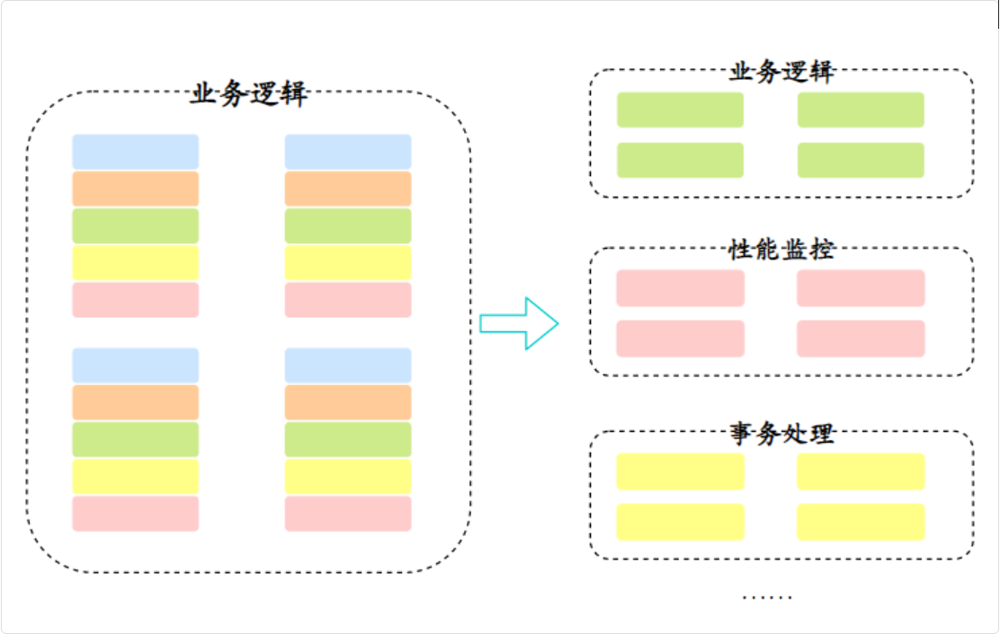
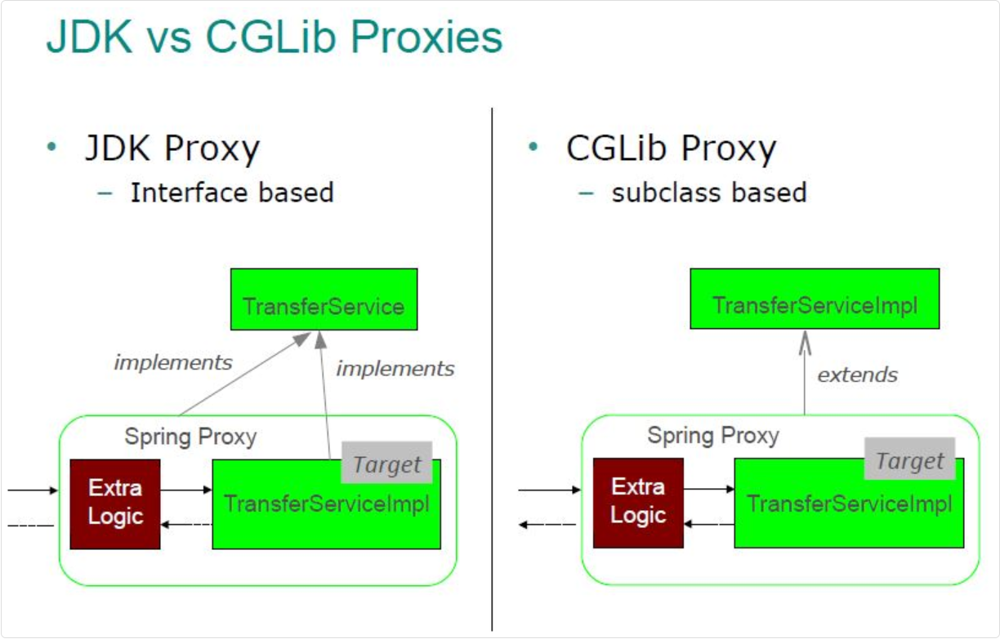

## AOP

AOP，也就是面向切面编程，简单点说，AOP 就是把一些业务逻辑中的相同代码抽取到一个独立的模块中，让业务逻辑更加清爽



从技术实现上来说，AOP 主要是通过动态代理来实现的

- 如果目标类实现了接口，就用 JDK 动态代理
- 如果没有实现接口，就用 CGLIB 来创建子类代理

代理对象会在方法执行前后插入我们定义的切面逻辑。



### 核心概念

Spring AOP 是 AOP 的一个具体实现

#### 切面 `@Aspect`

我们定义的一个类，包含了要在什么时候、什么地方执行什么逻辑

比如我们定义一个日志切面，专门负责记录方法的执行情况。在 Spring 中，我们会用 @Aspect 注解来标识一个切面类

#### 切点 `@Pointcut`

定义了在哪些地方应用切面逻辑

说白了就是告诉 Spring，我这个切面要在哪些方法上生效

比如我们可以定义一个切点表达式，让它匹配所有 Service 层的方法，或者匹配某个特定包下的所有方法

在 Spring 中用 `@Pointcut` 注解来定义，通常会写一些表达式，比如 `execution( com.example.service..*(..))` 这样的。

> @Pointcut 的方法只是一个标识符/别名，Spring 只关心注解里的表达式，方法体完全忽略

```plain
execution(* com.example.service.*.*(..))
           ↑         ↑          ↑  ↑  ↑
         返回值    包路径      类名 方法名 参数
         任意               任意类 任意方法 任意参数
```

#### 通知

是切面中具体要执行的代码逻辑

它有几种类型：

- `@Before` 是在方法执行前执行
- `@After` 是在方法执行后执行
- `@Around` 是环绕通知，可以在方法执行前后都执行
- `@AfterReturning` 是在方法正常返回后执行
- `@AfterThrowing` 是在方法抛出异常后执行

一般用得最多的是 @Around，因为它最灵活，可以控制方法是否执行，也可以修改参数和返回值

#### 连接点

被拦截到的点，因为 Spring 只支持方法类型的连接点，所以在 Spring 中，连接点指的是被拦截到的方法，实际上连接点还可以是字段或者构造方法

#### 织入

是把切面逻辑应用到目标对象的过程

Spring AOP 是在运行时通过动态代理来实现织入的，当我们从 Spring 容器中获取 Bean 的时候，如果这个 Bean 需要被切面处理，Spring 就会**返回一个代理对象**给我们。

#### 目标对象

被切面处理的对象，也就是我们平时写的 Service、Controller 等类

Spring AOP 会在目标对象上织入切面逻辑

#### 总结

```plain
切面（Aspect）
    ├── 切入点（Pointcut）─── 定义在哪里执行
    └── 通知（Advice）   ─── 定义何时执行什么
            ├── @Before
            ├── @After
            ├── @AfterReturning
            ├── @AfterThrowing
            └── @Around

目标对象（Target）──→ 代理对象（Proxy）──→ 织入（Weaving）
     ↑                                    ↓
连接点（Join Point）                    客户端调用
```

### 示例

#### 直接切面

##### 定义切面

> 好处是切点可以复用，多个通知可以引用同一个切点

```java
@Aspect
@Component
public class LogAspect {

  // 切点：匹配 service 包下所有方法
  @Pointcut("execution(* com.example.service.*.*(..))")
  public void serviceMethod() {}

  // 环绕通知：方法执行前后都介入
  @Around("serviceMethod()")
  public Object log(ProceedingJoinPoint jp) throws Throwable {
    String methodName = jp.getSignature().getName();
    Object[] args = jp.getArgs();

    log.info("{} 开始执行, 参数: {}", methodName, args);
    Object result = jp.proceed();  // 执行原方法
    log.info("{} 执行完毕", methodName);

    return result;
  }
}
```

> 也可以合并写

```java
@Around("execution(* com.example.service.*.*(..))")  // 直接写表达式
public Object log(ProceedingJoinPoint jp) { ... }
```

切点表达式直接写在通知注解里，不需要单独定义 `@Pointcut`

###### `ProceedingJoinPoint`

```java
// 获取方法名
String methodName = jp.getSignature().getName();  // "createUser"

// 获取方法参数
Object[] args = jp.getArgs();  // ["张三"]

// 获取目标对象（被代理的原始对象）
Object target = jp.getTarget();  // UserServiceImpl 实例

// 最重要：执行原始方法
Object result = jp.proceed();        // 用原来的参数执行
Object result = jp.proceed(newArgs); // 用修改后的参数执行
```

`ProceedingJoinPoint` 只有 `@Around` 能用，其他通知只能用 `JoinPoint`（没有 proceed()）

```java
// 不需要方法信息时，可以不写参数
@Before("serviceMethod()")
public void before() {
  log.info("方法开始执行");
}

// 需要方法信息时，加上 JoinPoint
@Before("serviceMethod()")
public void before(JoinPoint jp) {
  log.info("方法 {} 开始执行", jp.getSignature().getName());
}

// @Around 专用，需要控制原方法执行时用这个
@Around("serviceMethod()")
public Object around(ProceedingJoinPoint jp) throws Throwable {
  return jp.proceed();
}
```

##### 业务代码就会被代理

```java
public void createUser(String name) {
    userDao.save(name);  // 只有业务逻辑
}

public void deleteUser(Long id) {
    userDao.delete(id);  // 只有业务逻辑
}
```

日志会自动在每个 service 方法前后打印，不用动业务代码

#### 自定义注解 + AOP

##### 定义一个注解

```java
@Target(ElementType.METHOD)
@Retention(RetentionPolicy.RUNTIME)
public @interface LogRecord {
  String value() default "";
}
```

##### 切点改为匹配这个注解

```java
@Aspect
@Component
public class LogAspect {

  // 切点：匹配所有打了 @LogRecord 注解的方法
  @Pointcut("@annotation(com.example.annotation.LogRecord)")
  public void logMethod() {}

  @Around("logMethod()")
  public Object log(ProceedingJoinPoint jp) throws Throwable {
    // 还可以拿到注解的值
    LogRecord annotation = ((MethodSignature) jp.getSignature())
            .getMethod()
            .getAnnotation(LogRecord.class);
    log.info("操作：{}", annotation.value());
    return jp.proceed();
  }
}
```

##### 哪个方法需要就打注解

```java
@Service
public class UserService {

  @LogRecord("创建用户")   // ← 加上就生效，不加就不管
  public void createUser(String name) {
      userDao.save(name);
  }

  public void queryUser(Long id) {  // ← 没打注解，不会被拦截
      userDao.findById(id);
  }
}
```
