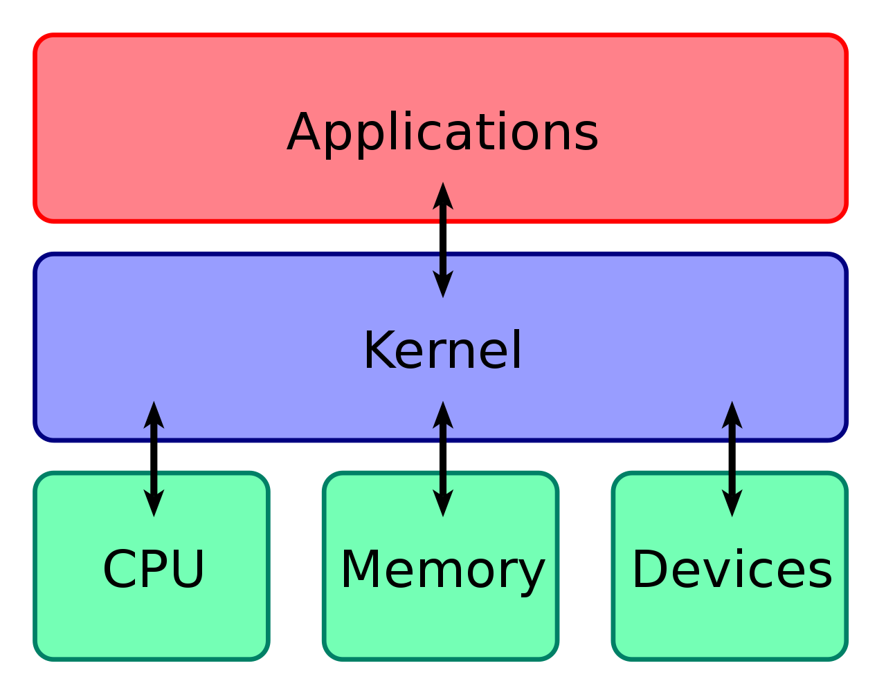
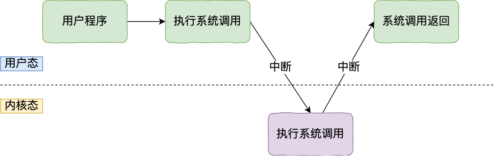

## OS

操作系统是一个广义概念，指管理计算机硬件和软件资源的完整软件系统

包含内核 + 系统程序 + 应用软件

内核 (Kernel)是操作系统的核心组件，直接管理硬件资源的最底层软件

### 内核

计算机是由各种外部硬件设备组成的，比如内存、cpu、硬盘等，如果每个应用都要和这些硬件设备对接通信协议，那这样太累了，所以这个中间人就由内核来负责

**让内核作为应用连接硬件设备的桥梁**，应用程序只需关心与内核交互，不用关心硬件的细节

现代操作系统，内核一般会提供 4 个基本能力：

- 管理进程、线程，决定哪个进程、线程使用 CPU，也就是进程调度的能力；
- 管理内存，决定内存的分配和回收，也就是内存管理的能力；
- 管理硬件设备，为进程与硬件设备之间提供通信能力，也就是硬件通信能力；
- 提供系统调用，如果应用程序要运行更高权限运行的服务，那么就需要有系统调用，它是用户程序与操作系统之间的接口

#### 内核（Kernel）

操作系统最核心的部分，运行在**内核态**（最高权限），负责：

- 管理硬件资源（CPU、内存、磁盘、网络）
- 提供系统调用（system call）给用户空间程序
- 进程调度、内存管理、设备驱动等

#### 用户空间（User Space）

内核之外的所有程序运行环境，运行在**用户态**（受限权限），包括：

- 系统工具（`ls`、`cp`、`bash` 等命令）
- 应用程序（浏览器、编辑器等）
- 库文件（`.so` 动态库）
- 配置文件

#### 内核是怎么工作

内核具有很高的权限，可以控制 cpu、内存、硬盘等硬件，而应用程序具有的权限很小

因此大多数操作系统，把内存分成了两个区域：

- 内核空间，这个内存空间只有内核程序可以访问；
- 用户空间，这个内存空间专门给应用程序使用；

用户空间的代码只能访问一个局部的内存空间，而内核空间的代码可以访问所有内存空间

因此，当程序使用用户空间时，我们常说该程序在用户态执行，而当程序使内核空间时，程序则在内核态执行

应用程序如果需要进入内核空间，就需要通过系统调用，下面来看看系统调用的过程：

内核程序执行在内核态，用户程序执行在用户态

当应用程序使用系统调用时，会产生一个中断

发生中断后，CPU 会中断当前在执行的用户程序，转而跳转到中断处理程序，也就是开始执行内核程序

内核处理完后，主动触发中断，把 CPU 执行权限交回给用户程序，回到用户态继续工作
