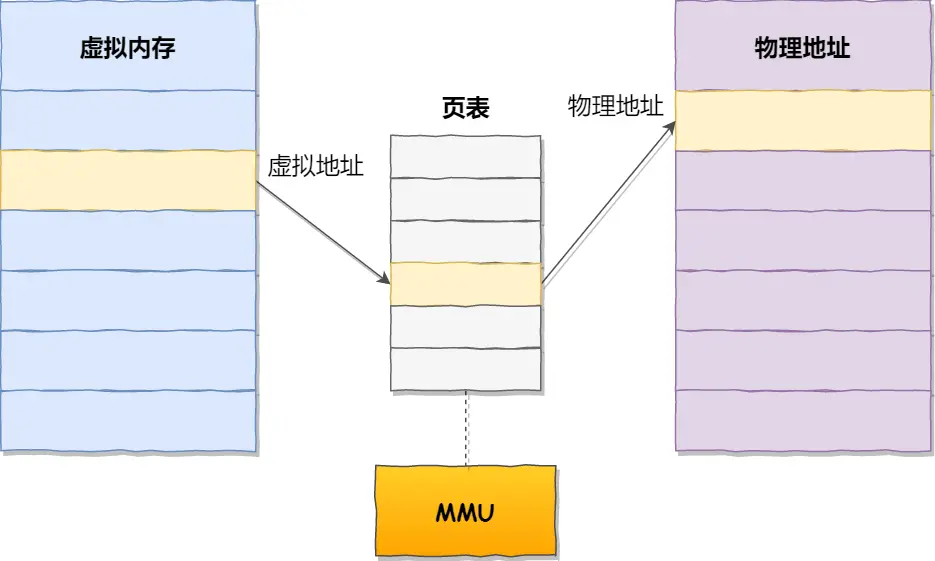
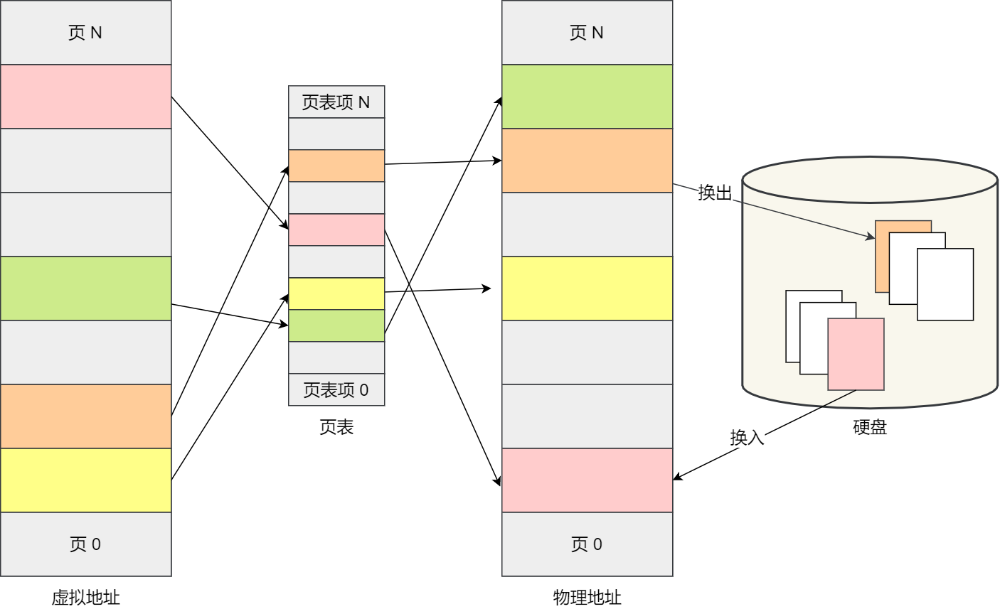
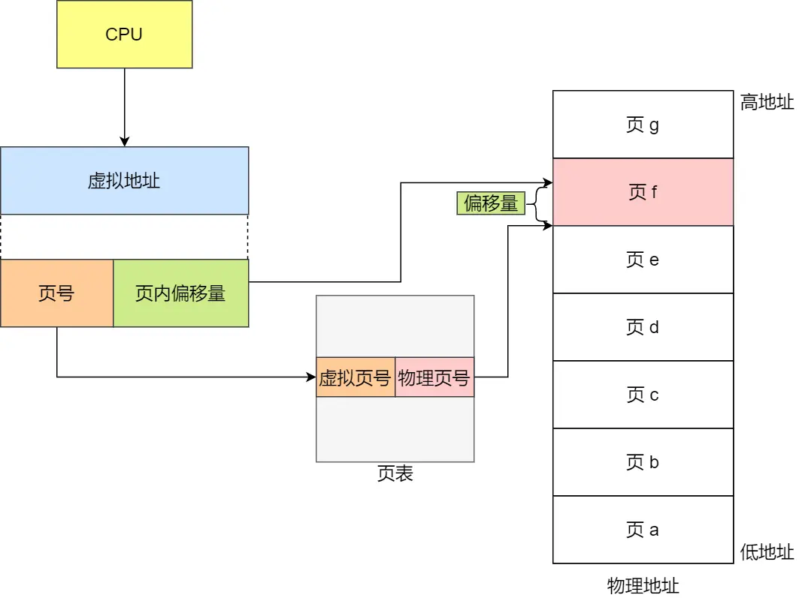

## OS

### 虚拟内存

单片机是没有操作系统的，所以每次写完代码，都需要借助工具把程序烧录进去，这样程序才能跑起来

另外，**单片机的 CPU 是直接操作内存的「物理地址」**

在这种情况下，要想在内存中同时运行两个程序是不可能的。如果第一个程序在 2000 的位置写入一个新的值，将会擦掉第二个程序存放在相同位置上的所有内容，所以同时运行两个程序是根本行不通的，这两个程序会立刻崩溃

> 操作系统是如何解决这个问题

可以把进程所使用的地址「隔离」开来，即让操作系统为**每个进程分配独立的一套「虚拟地址」**，人人都有，大家自己玩自己的地址就行，互不干涉

但是有个前提每个进程都不能访问物理地址，至于虚拟地址最终怎么落到物理内存里，操作系统已经把这些都安排的明明白白了

> 操作系统会提供一种机制，将不同进程的虚拟地址和不同内存的物理地址映射起来

如果程序要访问虚拟地址的时候，由操作系统转换成不同的物理地址，这样不同的进程运行的时候，写入的是不同的物理地址，这样就不会冲突了

- 我们程序所使用的内存地址叫做虚拟内存地址（Virtual Memory Address）
- 实际存在硬件里面的空间地址叫物理内存地址（Physical Memory Address）

操作系统引入了虚拟内存，进程持有的虚拟地址会通过 CPU 芯片中的内存管理单元（MMU）的映射关系，来转换变成物理地址，然后再通过物理地址访问内存

> 操作系统是如何管理虚拟地址与物理地址之间的关系

主要有两种方式，分别是**内存分段**和**内存分页**

#### 内存分段

程序是由若干个逻辑分段组成的，如可由代码分段、数据分段、栈段、堆段组成

不同的段是有不同的属性的，所以就用分段的形式把这些段分离出来

分段机制下的虚拟地址由两部分组成，**段选择因子**和**段内偏移量**

段选择因子和段内偏移量：

- **段选择因子**就保存在段寄存器里面。段选择因子里面最重要的是**段号**，用作段表的索引。段表里面保存的是这个段的基地址、段的界限和特权等级等。

- **虚拟地址**中的段内偏移量应该位于 0 和段界限之间，如果段内偏移量是合法的，就将段基地址加上段内偏移量得到物理内存地址

##### 缺点

- 第一个就是内存碎片的问题。
- 第二个就是内存交换的效率低的问题

#### 内存分页

分页是把**整个虚拟和物理内存空间切成一段段固定尺寸的大小**

这样一个连续并且尺寸固定的内存空间，我们叫**页**（Page）

在 Linux 下，每一页的大小为 4KB

虚拟地址与物理地址之间通过页表来映射

页表是存储在内存里的，内存管理单元 （MMU）就做将虚拟内存地址转换成物理地址的工作

而当进程访问的虚拟地址在页表中查不到时，系统会产生一个缺页异常，进入系统内核空间分配物理内存、更新进程页表，最后再返回用户空间，恢复进程的运行

> 因为内存分页机制分配内存的最小单位是一页，即使程序不足一页大小，我们最少只能分配一个页，所以页内会出现内存浪费，所以针对内存分页机制会有内部内存碎片的现象

##### 内存不足替换

如果内存空间不够，操作系统会把其他正在运行的进程中的「最近没被使用」的内存页面给释放掉，也就是暂时写在硬盘上，称为**换出**

一旦需要的时候，再加载进来，称为**换入**

所以，一次性写入磁盘的也只有少数的一个页或者几个页，不会花太多时间，**内存交换的效率就相对比较高**

更进一步地，分页的方式使得我们在加载程序的时候，不再需要一次性都把程序加载到物理内存中

我们完全可以在进行虚拟内存和物理内存的页之间的映射之后，并不真的把页加载到物理内存里，而是只有在程序运行中，需要用到对应虚拟内存页里面的指令和数据时，再加载到物理内存里面去

> 假设你有一个 1GB 的程序，但你的物理内存只有 512MB。如果没有虚拟内存，这个程序根本跑不起来

程序有 1000 页代码，但启动时只加载第 1 页（main 函数）→ 运行到函数 A 时，才加载函数 A 所在的页 → 运行到函数 B 时，才加载函数 B 所在的页

##### 分页机制映射关系

在分页机制下，虚拟地址分为两部分，页号和页内偏移

页号作为页表的索引，页表包含物理页每页所在物理内存的基地址，这个基地址与页内偏移的组合就形成了物理内存地址

总结一下，对于一个内存地址转换，其实就是这样三个步骤：

- 把虚拟内存地址，切分成页号和偏移量；
- 根据页号，从页表里面，查询对应的物理页号；
- 直接拿物理页号，加上前面的偏移量，就得到了物理内存地址

> 页表的实际意义就是将虚拟页号映射到物理页号

##### 简单分页的问题

有空间上的缺陷

因为操作系统是可以同时运行非常多的进程的，那这不就意味着页表会非常的庞大

在 32 位的环境下，虚拟地址空间共有 4GB (2^32)，假设一个页的大小是 4KB（2^12），那么就需要大约 100 万 （2^20） 个页

每个「页表项」需要 4 个字节大小来存储，那么整个 4GB 空间的映射就需要有 4MB 的内存来存储页表

这 4MB 大小的页表，看起来也不是很大。但是要知道每个进程都是有自己的虚拟地址空间的，也就说都有自己的页表。

那么，100 个进程的话，就需要 400MB 的内存来存储页表，这是非常大的内存了，更别说 64 位的环境了

##### 多级页表

要解决上面的问题，就需要采用一种叫作多级页表
