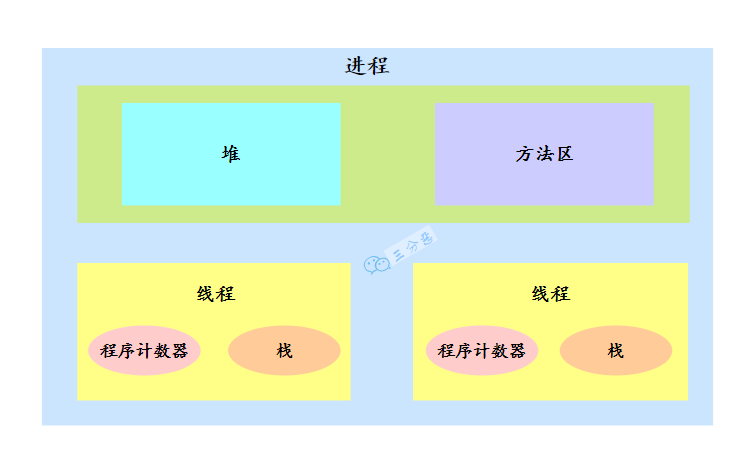
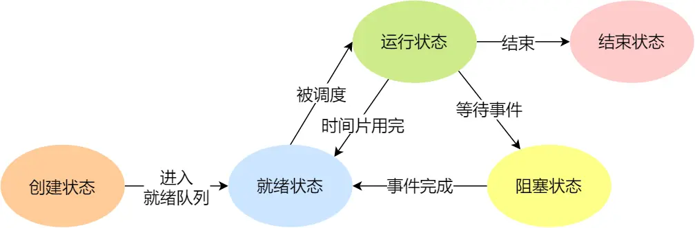
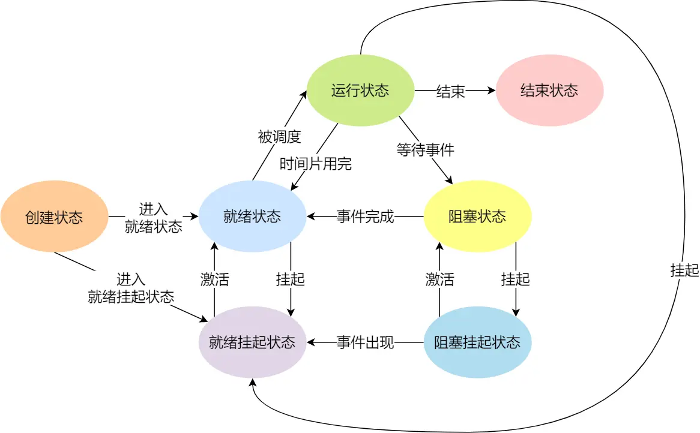
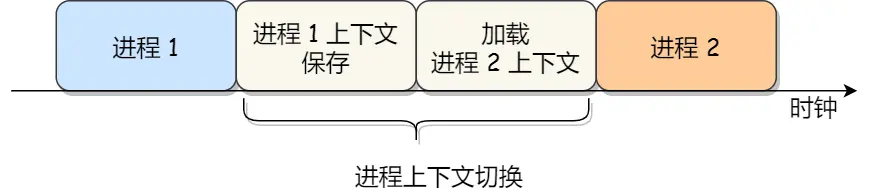

## OS

### 进程与线程的区别

进程是操作系统分配资源的最小单位，每个进程都有自己独立的内存地址空间。一个进程崩溃通常不会直接影响到其他进程（除非耗尽了系统资源）

线程是进程中的独立执行单元，是CPU分配调度的最小单位, 是操作系统真正放在 CPU 核心上去执行的实体

多个线程可以共享同一个进程的资源，如内存；每个线程都有自己独立的栈和寄存器

- 资源拥有
  进程有独立的地址空间（代码段、数据段、堆栈）；线程只拥有自己的栈和寄存器，共享进程的堆、全局变量等
- 开销
  进程切换开销大（要切换页表、刷新 TLB）；线程切换开销小（只切换寄存器和栈）
- 通信
  进程间通信需要 IPC 机制（管道、消息队列、共享内存等）；线程间可以直接读写共享数据
- 独立性
  进程间互不影响；一个线程崩溃可能导致整个进程挂掉

> 线程直接参与时间片分配，不是从进程那里"分"来的
>
> 默认情况下，每个线程平等参与调度，线程多的进程会获得更多 CPU 时间。 但现代调度器（如 Linux CFS）会考虑公平性，可能按进程组来分配 CPU 份额，避免线程数量影响公平性

### 进程与线程

进程说简单点就是我们在电脑上启动的一个个应用。它是操作系统分配资源的最小单位

线程是进程中的独立执行单元。多个线程可以共享同一个进程的资源，如内存；每个线程都有自己独立的栈和寄存器

### 进程

因为最开始计算机只能接受指令单步执行，为此就设计了批处理操作系统 (就是把一系列需要操作的指令写下来，形成一个清单，一次性交给计算机那种)

批处理操作系统在一定程度上提高了计算机的效率，但是由于批处理操作系统的指令运行方式仍然是串行的，内存中始终只有一个程序在运行，别人来还要等，批处理操作效率也不高

> 批处理操作系统的瓶颈在于内存中只存在一个程序，内存中能不能存在多个程序
>
> 进一步提出了进程

进程就是应用程序在内存中分配的空间，也就是正在运行的程序，各个进程之间互不干扰。同时进程保存着程序每一个时刻运行的状态

> 此时，CPU 采用时间片轮转的方式运行进程：CPU 为每个进程分配一个时间段，称作它的时间片。如果在时间片结束时进程还在运行，则暂停这个进程的运行，并且 CPU 分配给另一个进程（这个过程叫做上下文切换）
>
> 如果进程在时间片结束前阻塞或结束，则 CPU 立即进行切换，不用等待时间片用完

使用进程+CPU 时间片轮转方式的操作系统，在宏观上看起来同一时间段执行多个任务，在事实上，对于单核 CPU来说，任意具体时刻都只有一个任务在占用 CPU 资源

#### 进程的状态

> 所谓操作系统的任务调度，实际上的调度对象是线程，而进程只是给线程提供了虚拟内存、全局变量等资源

一共有六种状态

一个进程的活动期间至少具备三种基本状态，即运行状态、就绪状态、阻塞状态

- 运行状态（Running）：该时刻进程占用 CPU；
- 就绪状态（Ready）：可运行，由于其他进程处于运行状态而暂时停止运行；
- 阻塞状态（Blocked）：该进程正在等待某一事件发生（如等待输入/输出操作的完成）而暂时停止运行，这时，即使给它 CPU 控制权，它也无法运行

当然，进程还有另外两个基本状态：

- 创建状态（new）：进程正在被创建时的状态；
- 结束状态（Exit）：进程正在从系统中消失时的状态

一个完整的进程状态的变迁如下图：

- NULL -> 创建状态：一个新进程被创建时的第一个状态；
- 创建状态 -> 就绪状态：当进程被创建完成并初始化后，一切就绪准备运行时，变为就绪状态，这个过程是很快的；
- 就绪态 -> 运行状态：处于就绪状态的进程被操作系统的进程调度器选中后，就分配给 CPU 正式运行该进程；
- 运行状态 -> 结束状态：当进程已经运行完成或出错时，会被操作系统作结束状态处理；
- 运行状态 -> 就绪状态：处于运行状态的进程在运行过程中，由于分配给它的运行时间片用完，操作系统会把该进程变为就绪态，接着从就绪态选中另外一个进程运行；
- 运行状态 -> 阻塞状态：当进程请求某个事件且必须等待时，例如请求 I/O 事件；
- 阻塞状态 -> 就绪状态：当进程要等待的事件完成时，它从阻塞状态变到就绪状态

> 如果有大量处于阻塞状态的进程，进程可能会占用着物理内存空间，显然不是我们所希望的，毕竟物理内存空间是有限的，被阻塞状态的进程占用着物理内存就是一种浪费物理内存的行为。
>
> 所以，在虚拟内存管理的操作系统中，通常会把阻塞状态的进程的物理内存空间换出到硬盘，等需要再次运行的时候，再从硬盘换入到物理内存

那么，就需要一个新的状态，来描述进程没有占用实际的物理内存空间的情况，这个状态就是挂起状态。这跟阻塞状态是不一样，阻塞状态是等待某个事件的返回

另外，挂起状态可以分为两种：

- 阻塞挂起状态：进程在外存（硬盘）并等待某个事件的出现；
- 就绪挂起状态：进程在外存（硬盘），但只要进入内存，即刻立刻运行；

这两种挂起状态加上前面的五种状态，就变成了七种状态变迁

导致进程挂起的原因不只是因为进程所使用的内存空间不在物理内存，还包括如下情况：

- 通过 sleep 让进程间歇性挂起，其工作原理是设置一个定时器，到期后唤醒进程。
- 用户希望挂起一个程序的执行，比如在 Linux 中用 Ctrl+Z 挂起进程；

#### 进程的结构

PCB

在操作系统中，是用进程控制块（process control block，PCB）数据结构来描述进程的

PCB 是进程存在的唯一标识，这意味着一个进程的存在，必然会有一个 PCB，如果进程消失了，那么 PCB 也会随之消失

包含了很多信息：

进程描述信息、进程控制和管理信息、资源分配清单、CPU 相关信息等

通常是通过链表的方式进行组织，把具有相同状态的进程链在一起，组成各种队列

- 将所有处于就绪状态的进程链在一起，称为就绪队列；
- 把所有因等待某事件而处于等待状态的进程链在一起就组成各种阻塞队列；
- 另外，对于运行队列在单核 CPU 系统中则只有一个运行指针了，因为单核 CPU 在某个时间，只能运行一个程序

#### 进程的控制

#### 上下文切换

各个进程之间是共享 CPU 资源的，在不同的时候进程之间需要切换，让不同的进程可以在 CPU 执行，那么这个一个进程切换到另一个进程运行，称为进程的上下文切换

> CPU 上下文切换

大多数操作系统都是多任务，通常支持大于 CPU 数量的任务同时运行

实际上，这些任务并不是同时运行的，只是因为系统在很短的时间内，让各个任务分别在 CPU 运行，于是就造成同时运行的错觉

所以，操作系统需要事先帮 CPU 设置好 CPU 寄存器和程序计数器

CPU 寄存器是 CPU 内部一个容量小，但是速度极快的内存（缓存）

程序计数器则是用来存储 CPU 正在执行的指令位置、或者即将执行的下一条指令位置。

所以说，CPU 寄存器和程序计数是 CPU 在运行任何任务前，所必须依赖的环境，这些环境就叫做 **CPU 上下文**

CPU 上下文切换就是先把前一个任务的 CPU 上下文（CPU 寄存器和程序计数器）保存起来，然后加载新任务的上下文到这些**寄存器和程序计数器**，最后再跳转到程序计数器所指的新位置，运行新任务

系统内核会存储保持下来的上下文信息，当此任务再次被分配给 CPU 运行时，CPU 会重新加载这些上下文，这样就能保证任务原来的状态不受影响，让**任务**看起来还是连续运行

上面说到所谓的「任务」，主要包含进程、线程和中断。所以，可以根据任务的不同，把 CPU 上下文切换分成：**进程上下文切换、线程上下文切换和中断上下文切换**

##### 进程上下文切换

进程是由内核管理和调度的，所以进程的切换只能发生在内核态

进程的上下文切换不仅包含了**虚拟内存、栈、全局变量等用户空间的资源**，还包括了**内核堆栈、寄存器等内核空间的资源**。

通常，会把交换的信息保存在进程的 PCB，当要运行另外一个进程的时候，我们需要从这个进程的 PCB 取出上下文，然后恢复到 CPU 中，这使得这个进程可以继续执行

> 发生进程上下文切换有哪些场景

- 为了保证所有进程可以得到公平调度，CPU 时间被划分为一段段的时间片，这些时间片再被轮流分配给各个进程。这样，当某个进程的时间片耗尽了，进程就从运行状态变为就绪状态，系统从就绪队列选择另外一个进程运行；
- 进程在系统资源不足（比如内存不足）时，要等到资源满足后才可以运行，这个时候进程也会被挂起，并由系统调度其他进程运行；
- 当进程通过睡眠函数 sleep 这样的方法将自己主动挂起时，自然也会重新调度；
- 当有优先级更高的进程运行时，为了保证高优先级进程的运行，当前进程会被挂起，由高优先级进程来运行；
- 发生硬件中断时，CPU 上的进程会被中断挂起，转而执行内核中的中断服务程序

### 线程

对于多进程的这种方式，依然会存在问题：

- 进程之间如何通信，共享数据？
- 维护进程的系统开销较大，如创建进程时，分配资源、建立 PCB；终止进程时，回收资源、撤销 PCB；进程切换时，保存当前进程的状态信息；

那到底如何解决呢？需要有一种新的实体，满足以下特性：

- 实体之间可以并发运行；
- 实体之间共享相同的地址空间；

这个新的实体，就是线程 ( Thread )，线程之间可以并发运行且共享相同的地址空间

#### 简介

线程是进程当中的一条执行流程

同一个进程内多个线程之间可以共享代码段、数据段、打开的文件等资源，但每个线程各自都有一套独立的寄存器和栈，这样可以确保线程的控制流是相对独立的

> 优缺点

线程的优点：

- 一个进程中可以同时存在多个线程；
- 各个线程之间可以并发执行；
- 各个线程之间可以共享地址空间和文件等资源；

缺点：

- 当进程中的一个线程崩溃时，会导致其所属进程的所有线程崩溃 (这里是针对 C/C++ 语言，Java 语言中的线程奔溃不会造成进程崩溃)

#### 与进程对比

线程与进程的比较如下：

- 进程是资源（包括内存、打开的文件等）分配的单位，线程是 CPU 调度的单位；
- 进程拥有一个完整的资源平台，而线程只独享必不可少的资源，如寄存器和栈；
- 线程同样具有就绪、阻塞、执行三种基本状态，同样具有状态之间的转换关系；
- 线程能减少并发执行的时间和空间开销；

对于，线程相比进程能减少开销，体现在：

- 线程的创建时间比进程快，因为进程在创建的过程中，还需要资源管理信息，比如内存管理信息、文件管理信息，而线程在创建的过程中，不会涉及这些资源管理信息，而是共享它们；
- 线程的终止时间比进程快，因为线程释放的资源相比进程少很多；
- 同一个进程内的线程切换比进程切换快，因为线程具有相同的地址空间（虚拟内存共享），这意味着同一个进程的线程都具有同一个页表，那么在切换的时候不需要切换页表。而对于进程之间的切换，切换的时候要把页表给切换掉，而页表的切换过程开销是比较大的；
- 由于同一进程的各线程间共享内存和文件资源，那么在线程之间数据传递的时候，就不需要经过内核了，这就使得线程之间的数据交互效率更高了；

所以，不管是时间效率，还是空间效率线程比进程都要高。

#### 实现

主要有三种线程的实现方式：

- 用户线程（User Thread）：在用户空间实现的线程，不是由内核管理的线程，是由用户态的线程库来完成线程的管理；
- 内核线程（Kernel Thread）：在内核中实现的线程，是由内核管理的线程；
- 轻量级进程（LightWeight Process）：在内核中来支持用户线程；

现代操作系统（Linux/Windows）主要使用内核线程，因为多核支持和阻塞处理更好。用户线程和 LWP 现在更多是历史概念或特定场景使用

### 上下文切换

线程与进程最大的区别在于：**线程是调度的基本单位，而进程则是资源拥有的基本单位**

所以，所谓操作系统的任务调度，实际上的调度对象是线程，而进程只是给线程提供了虚拟内存、全局变量等资源。

对于线程和进程，我们可以这么理解：

- 当进程只有一个线程时，可以认为进程就等于线程；
- 当进程拥有多个线程时，这些线程会共享相同的虚拟内存和全局变量等资源，这些资源在上下文切换时是不需要修改的；

另外，线程也有自己的私有数据，比如栈和寄存器等，这些在上下文切换时也是需要保存的

> 线程的上下文切换

这还得看线程是不是属于同一个进程：

- 当两个线程不是属于同一个进程，则切换的过程就跟进程上下文切换一样；
- 当两个线程是属于同一个进程，因为虚拟内存是共享的，所以在切换时，虚拟内存这些资源就保持不动，只需要切换线程的私有数据、寄存器等不共享的数据；

所以总共的上下文切换：进程切换、线程切换、中断切换

> 如果同一进程的线程被分开调度，中间夹了其他进程的线程，那么实际上就经历了进程切换的开销。
>
> 这也是为什么调度器设计时会考虑亲和性（affinity）—— 尽量让同一进程的线程在较近的时间片内执行，减少内存上下文切换的次数

#### 线程切换

1. 保存当前线程的上下文
   - CPU 寄存器值（通用寄存器、状态寄存器等）
   - 程序计数器（PC）—— 指向下一条要执行的指令
   - 栈指针（SP）—— 指向当前栈顶
   - 浮点寄存器、向量寄存器等
2. 更新线程控制块（TCB）
   - 把上面保存的上下文信息写入当前线程的 TCB
   - 更新当前线程的状态（比如从 运行态 → 就绪态 或 运行态 → 阻塞态）
3. 调度下一个线程
   - 调度器从就绪队列中选择下一个要运行的线程
   - 更新该线程的状态（就绪态 → 运行态）
4. 恢复新线程的上下文
   - 从新线程的 TCB中加载之前保存的寄存器值
   - 恢复程序计数器、栈指针等
   - CPU 跳转到程序计数器指向的位置继续执行

### 协程

协程被视为比线程更轻量级的并发单元，可以在单线程中实现并发执行，由我们开发者显式调度。

协程是在用户态进行调度的，避免了线程切换时的内核态开销

在一些高级语言中（如 Go 的 Goroutine、Java 21+ 的 Virtual Threads、Python 的 asyncio），还会提到“协程”或“用户态线程”

这些通常是**语言运行时（Runtime）**级别的调度单位，比操作系统线程更轻量。但站在操作系统的视角，它能感知和分配 CPU 时间的最小底层单位，依然是内核态的线程
