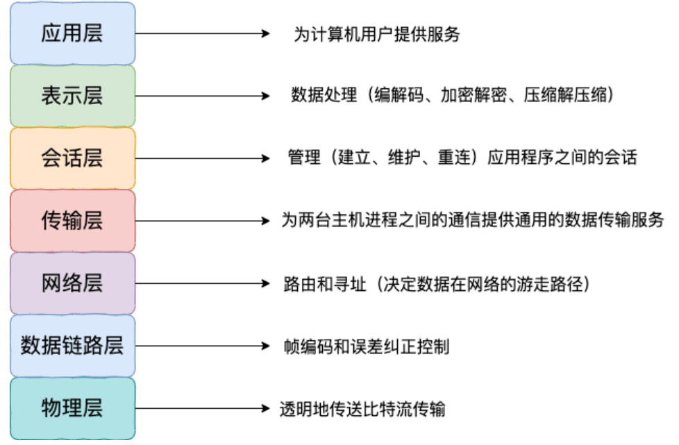
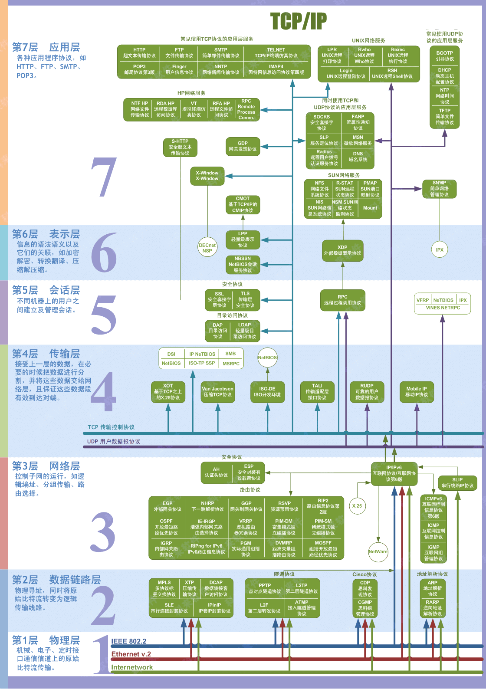
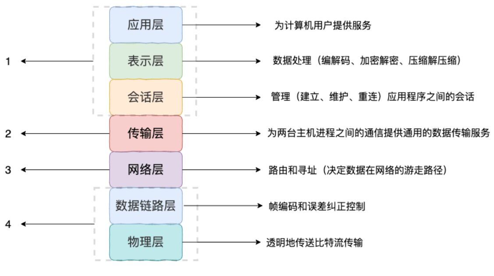
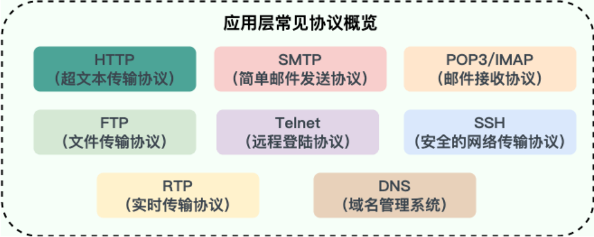
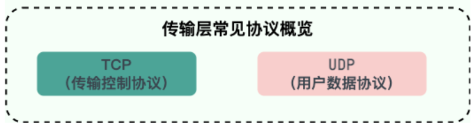

## 基础

### OSI 与 TCP/IP 网络模型

#### OSI 七层模型

> 物联网书会使用 (物数网传会表应)
>
> 物理层，数据链路层，网络层，传输层，会话层，表示层，用户层

OSI 七层模型 是国际标准化组织提出一个网络分层模型，其大体结构以及每一层提供的功能如下图所示

每一层都专注做一件事情，并且每一层都需要使用下一层提供的功能

比如传输层需要使用网络层提供的路由和寻址功能，这样传输层才知道把数据传输到哪里去

OSI 的七层体系结构概念清楚，理论也很完整，但是它比较复杂而且不实用，而且有些功能在多个层中重复出现

- 物理层：实现原始的数据传输，通过电缆光纤
- 链路层：将比特组装成帧，通过 MAC 地址进行节点间传输
- 网络层：负责 IP 寻址和路由选择，实现主机间通信 (IP 协议)
- 传输层：提供端到端的可靠/不可靠数据传输（TCP/UDP）
- 会话层：建立、管理和终止会话
- 表示层：数据格式转换、加密解密、压缩解压
- 应用层：为应用程序提供网络服务接口（HTTP、FTP 等）

#### TCP/IP 网络模型

> 应传网接

TCP/IP 四层模型 是目前被广泛采用的一种模型,我们可以将 TCP / IP 模型看作是 OSI 七层模型的精简版本，由以下 4 层组成：

1. 应用层
2. 传输层
3. 网络层
4. 网络接口层

需要注意的是，我们并不能将 TCP/IP 四层模型 和 OSI 七层模型完全精确地匹配起来，

不过可以简单将两者对应起来，如下图所示：

#### 应用层

应用层位于传输层之上，主要提供**两个终端设备上的应用程序**之间信息交换的服务，它定义了信息交换的格式，消息会交给下一层传输层来传输

把应用层交互的数据单元称为报文

应用层协议定义了网络通信规则，对于不同的网络应用需要不同的应用层协议

在互联网中应用层协议很多，如支持 Web 应用的 HTTP 协议，支持电子邮件的 SMTP 协议等等

常见协议：

- **HTTP（Hypertext Transfer Protocol，超文本传输协议）**：基于 TCP 协议，是一种用于传输超文本和多媒体内容的协议，主要是为 Web 浏览器与 Web 服务器之间的通信而设计的。当我们使用浏览器浏览网页的时候，我们网页就是通过 HTTP 请求进行加载的。
- **SMTP（Simple Mail Transfer Protocol，简单邮件发送协议）**：基于 TCP 协议，是一种用于发送电子邮件的协议。注意 ⚠️：SMTP 协议只负责邮件的发送，而不是接收。要从邮件服务器接收邮件，需要使用 POP3 或 IMAP 协议。
- **POP3/IMAP（邮件接收协议）**：基于 TCP 协议，两者都是负责邮件接收的协议。IMAP 协议是比 POP3 更新的协议，它在功能和性能上都更加强大。IMAP 支持邮件搜索、标记、分类、归档等高级功能，而且可以在多个设备之间同步邮件状态。几乎所有现代电子邮件客户端和服务器都支持 IMAP。
- **FTP（File Transfer Protocol，文件传输协议）** : 基于 TCP 协议，是一种用于在计算机之间传输文件的协议，可以屏蔽操作系统和文件存储方式。注意 ⚠️：FTP 是一种不安全的协议，因为它在传输过程中不会对数据进行加密。建议在传输敏感数据时使用更安全的协议，如 SFTP。
- **Telnet（远程登陆协议）**：基于 TCP 协议，用于通过一个终端登陆到其他服务器。Telnet 协议的最大缺点之一是所有数据（包括用户名和密码）均以明文形式发送，这有潜在的安全风险。这就是为什么如今很少使用 Telnet，而是使用一种称为 SSH 的非常安全的网络传输协议的主要原因。
- **SSH（Secure Shell Protocol，安全的网络传输协议）**：基于 TCP 协议，通过加密和认证机制实现安全的访问和文件传输等业务
- **RTP（Real-time Transport Protocol，实时传输协议）**：通常基于 UDP 协议，但也支持 TCP 协议。它提供了端到端的实时传输数据的功能，但不包含资源预留存、不保证实时传输质量，这些功能由 WebRTC 实现。
- **DNS（Domain Name System，域名管理系统）**: 通常基于 UDP 协议（端口 53），用于解决域名和 IP 地址的映射问题。当响应数据过大或进行区域传送时会改用 TCP

#### 传输层

传输层的主要任务就是负责向**两台终端设备进程**之间的通信提供通用的数据传输服务

应用进程利用该服务传送应用层报文

“通用的”是指并不针对某一个特定的网络应用，而是多种应用可以使用同一个运输层服务

- **TCP（Transmission Control Protocol，传输控制协议 ）**：提供 **面向连接** 的，**可靠** 的数据传输服务。
- **UDP（User Datagram Protocol，用户数据协议）**：提供 **无连接** 的，**尽最大努力** 的数据传输服务（不保证数据传输的可靠性），简单高效

#### 网络层

**网络层负责为分组交换网上的不同主机提供通信服务**

 在发送数据时，网络层把运输层产生的报文段或用户数据报封装成分组和包进行传送。在 TCP/IP 体系结构中，由于网络层使用 IP 协议，因此分组也叫 IP 数据报，简称数据报。

**网络层的还有一个任务就是选择合适的路由，使源主机运输层所传下来的分组，能通过网络层中的路由器找到目的主机**

互联网是由大量的异构（heterogeneous）网络通过路由器（router）相互连接起来的。互联网使用的网络层协议是无连接的网际协议（Internet Protocol）和许多路由选择协议，因此互联网的网络层也叫做 **网际层** 或 **IP 层**

#### 网络接口层

可以把网络接口层看作是数据链路层和物理层的合体。

1. 数据链路层(data link layer)通常简称为链路层（ 两台主机之间的数据传输，总是在一段一段的链路上传送的）。**数据链路层的作用是将网络层交下来的 IP 数据报组装成帧，在两个相邻节点间的链路上传送帧。每一帧包括数据和必要的控制信息（如同步信息，地址信息，差错控制等）。**
2. **物理层的作用是实现相邻计算机节点之间比特流的透明传送，尽可能屏蔽掉具体传输介质和物理设备的差异**

### 网络为什么要分层

#### 分层的好处

1. **各层之间相互独立**：各层之间相互独立，各层之间不需要关心其他层是如何实现的，只需要知道自己如何调用下层提供好的功能就可以了（可以简单理解为接口调用）**。这个和我们对开发时系统进行分层是一个道理。**
2. **提高了整体灵活性**：每一层都可以使用最适合的技术来实现，你只需要保证你提供的功能以及暴露的接口的规则没有改变就行了。**这个和我们平时开发系统的时候要求的高内聚、低耦合的原则也是可以对应上的。**
3. **大问题化小**：分层可以将复杂的网络问题分解为许多比较小的、界线比较清晰简单的小问题来处理和解决。这样使得复杂的计算机网络系统变得易于设计，实现和标准化。 **这个和我们平时开发的时候，一般会将系统功能分解，然后将复杂的问题分解为容易理解的更小的问题是相对应的，这些较小的问题具有更好的边界（目标和接口）定义**

#### 简单例子

**HTTP 和传输层的关系**

- **独立性**：HTTP 应用层不需要知道数据是通过 TCP 还是 QUIC 传输的，它只需要调用"发送数据"接口就行
- **灵活性**：你可以随时把 TCP 换成 QUIC（更高效的协议），但 HTTP 的代码完全不需要改变，只要接口保持一致
- **化简问题**：上层程序员只需要考虑"如何实现业务逻辑"，不需要考虑"数据如何在网络上传输"——每层各管各的

**Wi-Fi vs 有线网络**

- 你的浏览器（应用层）不关心是 Wi-Fi 还是网线
- 只要物理层保证数据能送到，上面的所有层都能正常工作
- 这就是"各层独立、互不影响"
