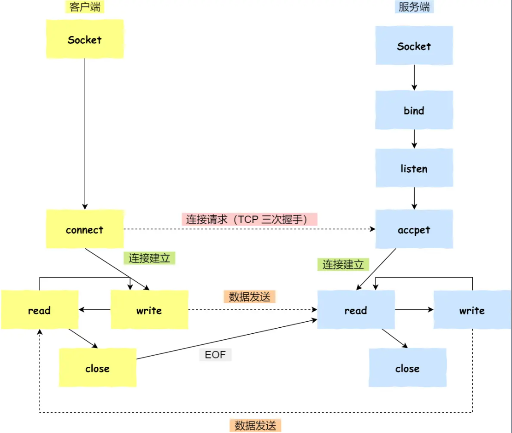
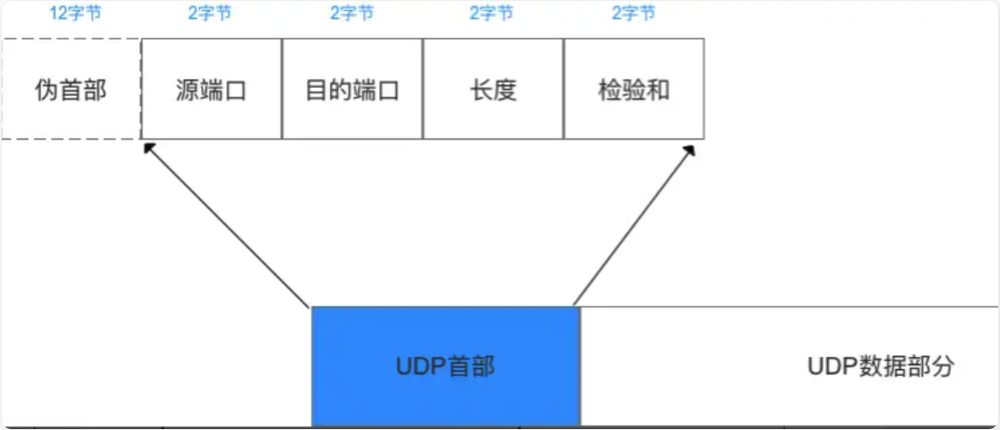

## 传输层

### Socket

即套接字，是应用层 与 TCP/IP 协议族通信的中间软件抽象层，表现为一个封装了 TCP / IP协议族 的编程接口（API）

> Socket是一个编程接口，让你不用关心TCP/IP协议细节，直接调用函数就能收发数据

| 类型 | 协议 | 特点 | 用途 |
| --- | --- | --- | --- |
| **TCP Socket** | TCP | 可靠、有序、面向连接 | HTTP、邮件、FTP |
| **UDP Socket** | UDP | 快速、无连接 | 视频直播、在线游戏、DNS |

对用户来说，只需调用Socket去组织数据，以符合指定的协议，即可通信

#### 流程



- 服务端和客户端初始化 `socket`，得到文件描述符；
- 服务端调用 `bind`，将 socket 绑定在指定的 IP 地址和端口;
- 服务端调用 `listen`，进行监听；
- 服务端调用 `accept`，等待客户端连接；
- 客户端调用 `connect`，向服务端的地址和端口发起连接请求；
- 服务端 `accept` 返回用于传输的 `socket` 的文件描述符；
- 客户端调用 `write` 写入数据；服务端调用 `read` 读取数据；
- 客户端断开连接时，会调用 `close`，那么服务端 `read` 读取数据的时候，就会读取到了 `EOF`，待处理完数据后，服务端调用 `close`，表示连接关闭。

这里需要注意的是，服务端调用 `accept` 时，连接成功了会返回一个已完成连接的 socket，后续用来传输数据。

所以，监听的 socket 和真正用来传送数据的 socket，是「两个」 socket，一个叫作**监听 socket**，一个叫作**已完成连接 socket**。

成功连接建立之后，双方开始通过 read 和 write 函数来读写数据，就像往一个文件流里面写东西一样。

#### listen 时候参数 backlog 的意义

Linux内核中会维护两个队列：

- 半连接队列（SYN 队列）：接收到一个 SYN 建立连接请求，处于 SYN_RCVD 状态；
- 全连接队列（Accpet 队列）：已完成 TCP 三次握手过程，处于 ESTABLISHED 状态；

#### accept 发生在三次握手的哪一步

```
时间线：

T1: 服务器程序创建监听Socket
    listen_socket.bind("0.0.0.0", 80)
    listen_socket.listen()
    ↓
    内核：在端口80上建立一个"接收队列"

T2: 客户端发送SYN
    ↓
T3: 内核自动回复SYN-ACK（三次握手发生在内核）
    ↓
T4: 客户端发送ACK
    ↓
    内核：三次握手完成！创建一个新的Socket，
         放入"接收队列"

T5: 服务器程序调用accept()
    client_socket = listen_socket.accept()
    ↓
    内核：把已连接的Socket返回给应用程序
    ↓
    应用程序现在拿到了client_socket
```

- 客户端的协议栈向服务端发送了 SYN 包，并告诉服务端当前发送序列号 client_isn，客户端进入 SYN_SENT 状态；
- 服务端的协议栈收到这个包之后，和客户端进行 ACK 应答，应答的值为 client_isn+1，表示对 SYN 包 client_isn 的确认，同时服务端也发送一个 SYN 包，告诉客户端当前我的发送序列号为 server_isn，服务端进入 SYN_RCVD 状态；
- 客户端协议栈收到 ACK 之后，使得应用程序从 `connect` 调用返回，表示客户端到服务端的单向连接建立成功，客户端的状态为 ESTABLISHED，同时客户端协议栈也会对服务端的 SYN 包进行应答，应答数据为 server_isn+1；
- ACK 应答包到达服务端后，服务端的 TCP 连接进入 ESTABLISHED 状态，同时服务端协议栈使得 `accept` 阻塞调用返回，这个时候服务端到客户端的单向连接也建立成功。至此，客户端与服务端两个方向的连接都建立成功。

从上面的描述过程，我们可以得知**客户端 connect 成功返回是在第二次握手，服务端 accept 成功返回是在三次握手成功之后**

### UDP

#### UDP协议特点

- UDP是无连接的传输层协议；
- UDP使用尽最大努力交付，不保证可靠交付；
- UDP是面向报文的，对应用层交下来的报文，不合并，不拆分，保留原报文的边界；
- UDP没有拥塞控制，因此即使网络出现拥塞也不会降低发送速率；
- UDP支持一对一　一对多　多对多的交互通信；
- UDP的首部开销小，只有８字节

#### TCP 与 UDP 对比

| 特性 | TCP | UDP |
| --- | --- | --- |
| **连接性** | 面向连接 | 无连接 |
| **可靠性** | 可靠 | 不可靠 (尽力而为) |
| **状态维护** | 有状态 | 无状态 |
| **传输效率** | 较低 | 较高 |
| **传输形式** | 面向字节流 | 面向数据报 (报文) |
| **头部开销** | 20 - 60 字节 | 8 字节 |
| **通信模式** | 点对点 (单播) | 单播、多播、广播 |
| **常见应用** | HTTP/HTTPS, FTP, SMTP, SSH | DNS, DHCP, SNMP, TFTP, VoIP, 视频流 |

- TCP是可靠传输，UDP是不可靠传输;
- TCP面向连接，UDP无连接;
- TCP传输数据有序，UDP不保证数据的有序性;
- TCP不保存数据边界，UDP保留数据边界;
- TCP传输速度相对UDP较慢;
- TCP有流量控制和拥塞控制，UDP没有;
- TCP是重量级协议，UDP是轻量级协议;
- TCP首部较长20字节，UDP首部较短８字节;

#### 基于TCP和UDP的常用协议

HTTP、HTTPS、FTP、TELNET、SMTP(简单邮件传输协议)协议基于可靠的TCP协议。

TFTP、DNS、DHCP、TFTP、SNMP(简单网络管理协议)、RIP基于不可靠的UDP协议

#### 报文段

UDP的报文段共有2个字段：数据字段 + 首部字段



**UDP报文中每个字段的含义如下：**

- 源端口：这个字段占据 UDP 报文头的前 16 位，通常包含发送数据报的应用程序所使用的 UDP 端口，接收端的应用程序利用这个字段的值作为发送响应的目的地址，这个字段是可选的，所以发送端的应用程序不一定会把自己的端口号写入该字段中，如果不写入端口号，则把这个字段设置为 0，这样，接收端的应用程序就不能发送响应了。
- 目的端口：接收端计算机上 UDP 软件使用的端口，占据 16 位。
- 长度：该字段占据 16 位，表示 UDP 数据报长度，包含 UDP 报文头和 UDP 数据长度，因为 UDP 报文头长度是 8 个字节，所以这个值最小为 8。
- 校验值：该字段占据 16 位，可以检验数据在传输过程中是否被损坏
