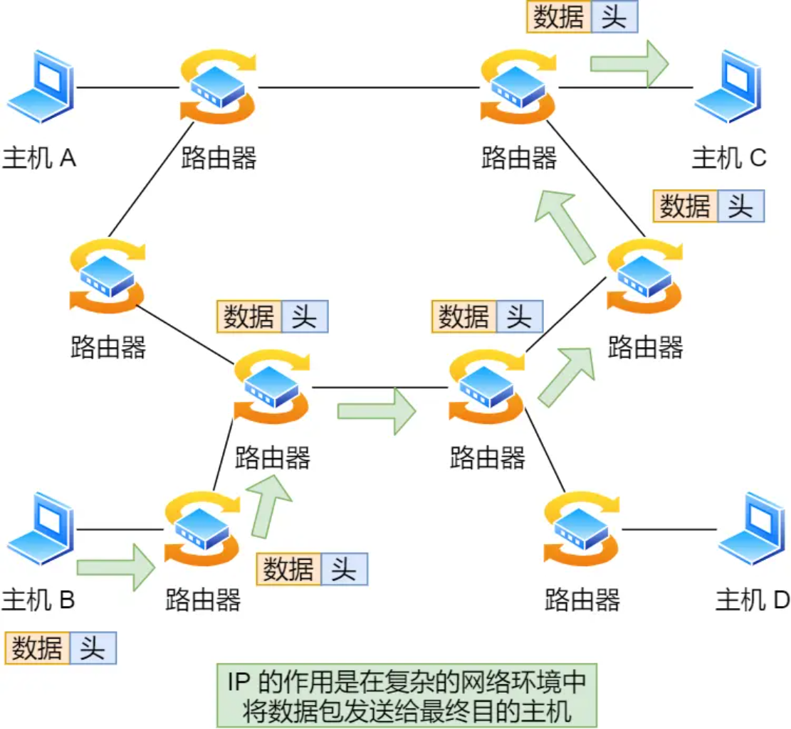
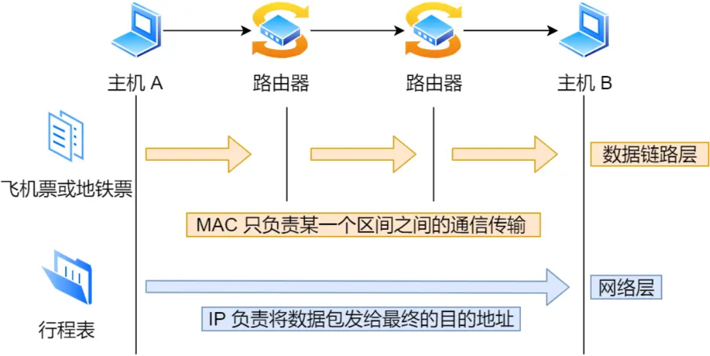
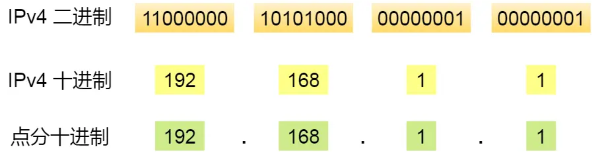
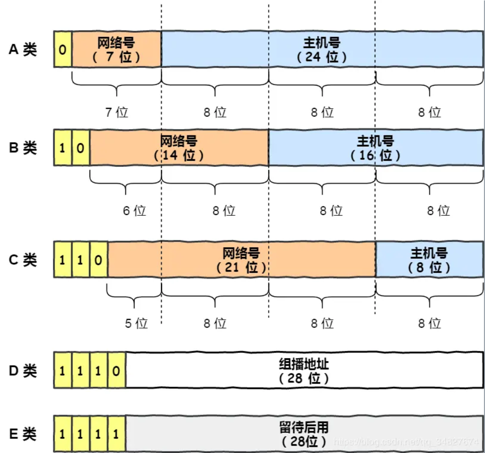
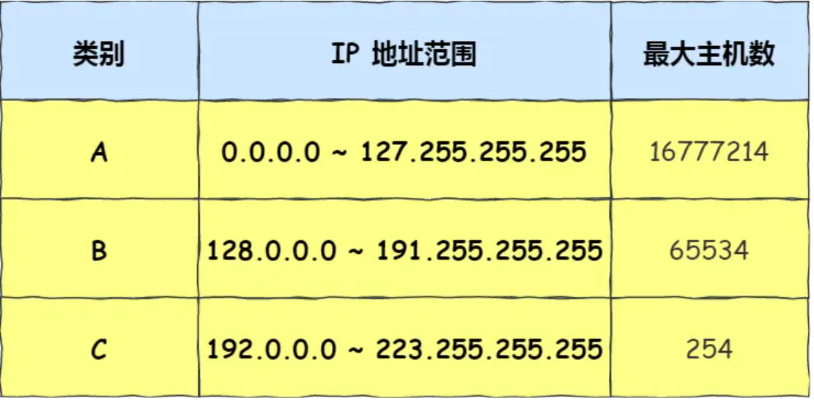
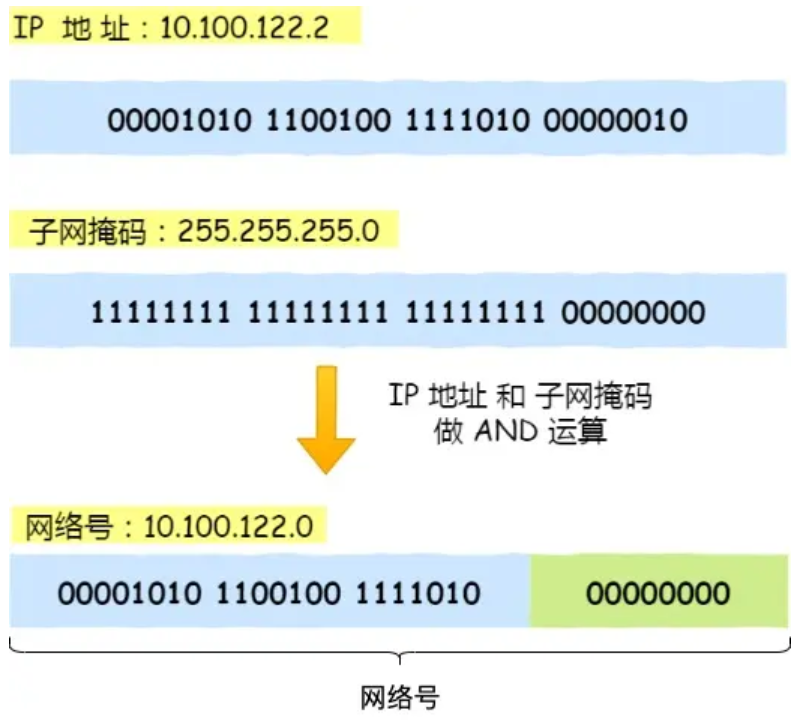
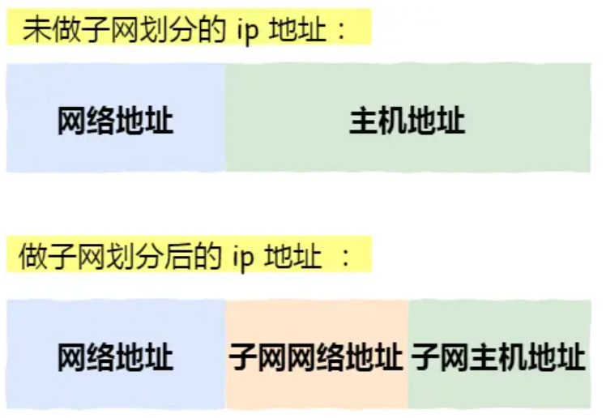
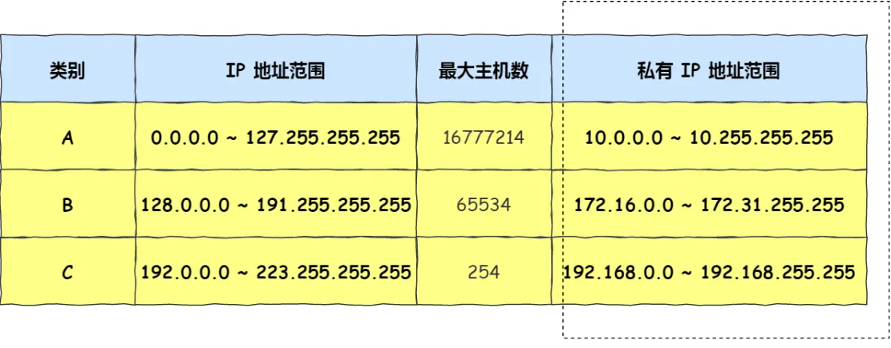

## 网络层

网络层的主要作用是：实现主机与主机之间的通信，也叫点对点（end to end）通信



### 网络层与数据链路层有什么关系

IP（网络层） 和 MAC （数据链路层）之间的区别和关系

IP 的作用是主机之间通信用的，而 **MAC 的作用则是实现「直连」的两个设备之间通信，而 IP 则负责在「没有直连」的两个网络之间进行通信传输**

> 在区间内移动相当于数据链路层，充当区间内两个节点传输的功能，区间内的出发点好比源 MAC 地址，目标地点好比目的 MAC 地址。
>
> 整个旅游行程表就相当于网络层，充当远程定位的功能，行程的开始好比源 IP，行程的终点好比目的 IP 地址



只有两者兼备，既有某个区间的车票又有整个旅行的行程表，才能保证到达目的地。与此类似，**计算机网络中也需要「数据链路层」和「网络层」这个分层才能实现向最终目标地址的通信。**

还有重要一点，旅行途中我们虽然不断变化了交通工具，但是旅行行程的起始地址和目的地址始终都没变。

其实，在网络中数据包传输中也是如此，**源IP地址和目标IP地址在传输过程中是不会变化的（前提：没有使用 NAT 网络），只有源 MAC 地址和目标 MAC 一直在变化**

### IP 基础

在 TCP/IP 网络通信时，为了保证能正常通信，每个设备都需要配置正确的 IP 地址，否则无法实现正常的通信。

IP 地址（IPv4 地址）由 `32` 位正整数来表示，IP 地址在计算机是以二进制的方式处理的。

而人类为了方便记忆采用了**点分十进制**的标记方式，也就是将 32 位 IP 地址以每 8 位为组，共分为 `4` 组，每组以「`.`」隔开，再将每组转换成十进制



IP 地址最大值就是 $2^32=4294967296$

也就说，最大允许 43 亿台计算机连接到网络。

实际上，IP 地址并不是根据主机台数来配置的，而是以网卡。像服务器、路由器等设备都是有 2 个以上的网卡，也就是它们会有 2 个以上的 IP 地址

#### IP 分类

互联网诞生之初，IP 地址显得很充裕，于是计算机科学家们设计了分类地址。

IP 地址分类成了 5 种类型，分别是 A 类、B 类、C 类、D 类、E 类



> 什么是 A B C 类

其中对于 A、B、C 类主要分为两个部分，分别是网络号和主机号



最大主机个数，就是要看主机号的位数，如 C 类地址的主机号占 8 位，那么 C 类地址的最大主机个数 $2^8 - 2 = 254$

> 为什么要减 2 呢？

因为在 IP 地址中，有两个 IP 是特殊的，分别是主机号全为 1 和 全为 0 地址

- 主机号全为 1 指定某个网络下的所有主机，用于广播
- 主机号全为 0 指定某个网络

> 什么是 D、E 类地址

而 D 类和 E 类地址是没有主机号的，所以不可用于主机 IP，D 类常被用于多播，E 类是预留的分类，暂时未使用

##### 缺点

*缺点一*

**同一网络下没有地址层次**，比如一个公司里用了 B 类地址，但是可能需要根据生产环境、测试环境、开发环境来划分地址层次，而这种 IP 分类是没有地址层次划分的功能，所以这就**缺少地址的灵活性**。

*缺点二*

A、B、C类有个尴尬处境，就是**不能很好的与现实网络匹配**。

- C 类地址能包含的最大主机数量实在太少了，只有 254 个，估计一个网吧都不够用。
- 而 B 类地址能包含的最大主机数量又太多了，6 万多台机器放在一个网络下面，一般的企业基本达不到这个规模，闲着的地址就是浪费。

这两个缺点，都可以在 `CIDR` 无分类地址解决

#### 无分类地址 CIDR

正因为 IP 分类存在许多缺点，所以后面提出了无分类地址的方案，即 `CIDR`。

这种方式不再有分类地址的概念，32 比特的 IP 地址被划分为两部分，前面是**网络号**，后面是**主机号**

> 怎么划分网络号和主机号的

表示形式 `a.b.c.d/x`，其中 `/x` 表示前 x 位属于**网络号**， x 的范围是 `0 ~ 32`，这就使得 IP 地址更加具有灵活性。

比如 `10.100.122.2/24`，这种地址表示形式就是 CIDR，/24 表示前 24 位是网络号，剩余的 8 位是主机号

还有另一种划分网络号与主机号形式，那就是**子网掩码**，掩码的意思就是掩盖掉主机号，剩余的就是网络号

**将子网掩码和 IP 地址按位计算 AND，就可得到网络号**



##### 为什么要分离网络号和主机号

因为两台计算机要通讯，首先要判断是否处于同一个广播域内，即网络地址是否相同。如果网络地址相同，表明接受方在本网络上，那么可以把数据包直接发送到目标主机。

路由器寻址工作中，也就是通过这样的方式来找到对应的网络号的，进而把数据包转发给对应的网络内

**因为两台计算机要通讯，首先要判断是否处于同一个广播域内，即网络地址是否相同。**

这意味着，当计算机 A 要给计算机 B 发数据时，第一步不是直接发，而是先问一个问题：**B 在我的本网络上吗？**

怎么判断呢？就是比较双方的**网络号**部分是否相同。

比如：

- A 的 IP 是 `10.100.122.5/24`（网络号是 `10.100.122.0`）
- B 的 IP 是 `10.100.122.10/24`（网络号也是 `10.100.122.0`）
- 网络号相同，说明 B 在我的本网络上

**第二句：如果网络地址相同，表明接受方在本网络上，那么可以把数据包直接发送到目标主机。**

既然对方在本网络上，就可以**直接发送**，不需要经过路由器。

计算机 A 会用 ARP 协议（数据链路层）去查找 B 的 MAC 地址，然后直接通过以太网把数据发过去。

**第三句：路由器寻址工作中，也就是通过这样的方式来找到对应的网络号的，进而把数据包转发给对应的网络内。**

反过来，如果网络号**不同**，说明对方在其他网络上，就需要经过路由器。

路由器会根据 IP 地址的网络号部分去查找**路由表**，找到应该转发到哪个网络去，然后把数据包转发过去。

- *核心理解：**分离网络号和主机号，就是为了快速判断"对方在不在本网络上"——
- 在本网络 → 直接发
- 不在本网络 → 路由器帮你转发

##### 子网划分

我们知道可以通过子网掩码划分出网络号和主机号，那实际上子网掩码还有一个作用，那就是**划分子网**

**子网划分实际上是将主机地址分为两个部分：子网网络地址和子网主机地址**



假设对 C 类地址进行子网划分，网络地址 192.168.1.0，使用子网掩码 255.255.255.192 对其进行子网划分。

C 类地址中前 24 位是网络号，最后 8 位是主机号，根据子网掩码可知**从 8 位主机号中借用 2 位作为子网号**

由于子网网络地址被划分成 2 位，那么子网地址就有 4 个，分别是 00、01、10、11

#### 公有 IP 和 私有 IP

在 A、B、C 分类地址，实际上有分公有 IP 地址和私有 IP 地址



**RFC 1918 标准定义的私有地址范围：**

- **A 类私有地址**：`10.0.0.0/8`（对应原 A 类）
- **B 类私有地址**：`172.16.0.0/12`（对应原 B 类）
- **C 类私有地址**：`192.168.0.0/16`（对应原 C 类）

这些就是从 ABC 分类时代遗留下来的定义，一直沿用到现在。

**但在实际使用中，企业还是用 CIDR 来进一步划分。**

比如某企业申请了一个私有地址 `10.0.0.0/8`（A 类范围），内部会这样划分：

```
生产环境：10.1.0.0/16
测试环境：10.2.0.0/16
开发环境：10.3.0.0/16`
```

**总结：**

- **私有 IP 的范围定义** → 还是按 ABC 分类
- **私有 IP 的实际管理和划分** → 用 CIDR

所以你的理解是对的，ABC 分类虽然在公网上被 CIDR 取代了，但它的影子还是保留在私有地址的定义里

私有 IP 地址通常是内部的 IT 人员管理，公有 IP 地址是由 `ICANN` 组织管理，中文叫「互联网名称与数字地址分配机构」。

IANA 是 ICANN 的其中一个机构，它负责分配互联网 IP 地址，是按州的方式层层分配

- ARIN 北美地区
- LACNIC 拉丁美洲和一些加勒比群岛
- RIPE NCC 欧洲、中东和中亚
- AfriNIC 非洲地区
- APNIC 亚太地区

其中，在中国是由 CNNIC 的机构进行管理，它是中国国内唯一指定的全局 IP 地址管理的组织

##### 简单例子

**地区 RIR 的管理范围：**

`APNIC（亚太）→ IP 段: 1.0.0.0/8 ~ 223.255.255.255/8 的一部分
RIPE NCC（欧洲）→ IP 段: 194.0.0.0/6 ~ 195.0.0.0/6 等
ARIN（北美）→ IP 段: 8.0.0.0/4 ~ 15.0.0.0/4 等
LACNIC（南美）→ IP 段: 177.0.0.0/8 ~ 179.0.0.0/8 等
AFRINIC（非洲）→ IP 段: 41.0.0.0/8 等`

**在地区内部的分配：**

以 APNIC 为例，它再细分给不同国家：

`中国：58.0.0.0/8、210.0.0.0/8 等
日本：61.0.0.0/8、203.0.0.0/8 的一部分
澳大利亚：1.0.0.0/8 的一部分`

**甚至更细致（但不严格）：**

在中国内部，不同运营商也有大概的 IP 段范围：

`中国移动：58.0.0.0/8、139.0.0.0/8 的一部分
中国电信：1.0.0.0/8 的一部分、202.0.0.0/8 的一部分
中国联通：210.0.0.0/8 的一部分、123.0.0.0/8 的一部分`

**但这不是绝对的：**

- 一个 IP 段不一定完全对应一个地区或运营商，可能被分割或重新分配
- 某些大公司可能拥有跨多个地区的 IP 段
- 你可以用 `whois` 命令查询某个 IP 的归属地和运营商

**例子：**

```
$ whois 8.8.8.8
结果：Google LLC, United States`
```
