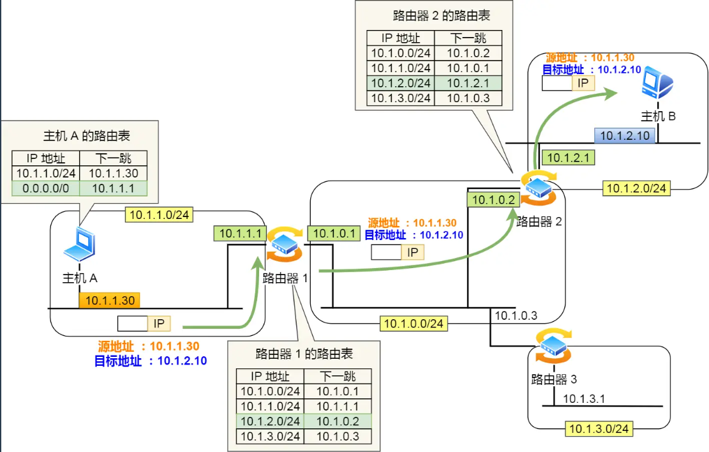
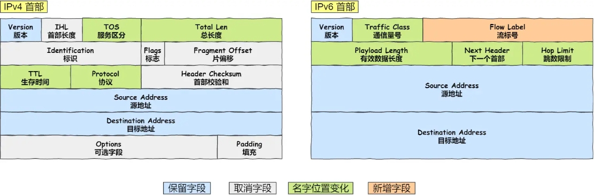
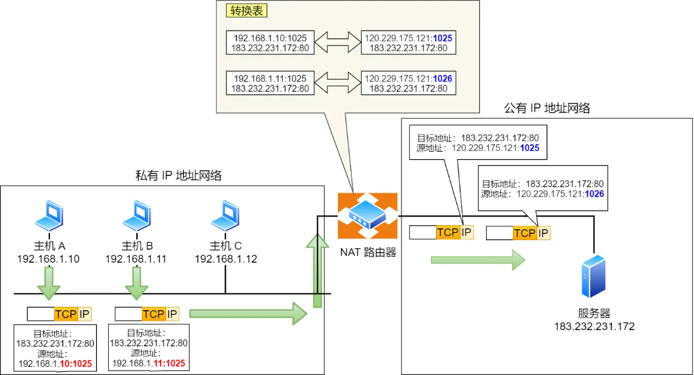

## 网络层

### IP 地址与路由控制

IP地址的**网络地址**这一部分是用于进行路由控制。

路由控制表中记录着网络地址与下一步应该发送至路由器的地址。在主机和路由器上都会有各自的路由器控制表。

在发送 IP 包时，首先要确定 IP 包首部中的目标地址，再从路由控制表中找到与该地址具有**相同网络地址**的记录，根据该记录将 IP 包转发给相应的下一个路由器。如果路由控制表中存在多条相同网络地址的记录，就选择相同位数最多的网络地址，也就是最长匹配。

下面以下图的网络链路作为例子说明：



1. 主机 A 要发送一个 IP 包，其源地址是 `10.1.1.30` 和目标地址是 `10.1.2.10`，由于没有在主机 A 的路由表找到与目标地址 `10.1.2.10` 相同的网络地址，于是包被转发到默认路由（路由器 `1` ）
2. 路由器 `1` 收到 IP 包后，也在路由器 `1` 的路由表匹配与目标地址相同的网络地址记录，发现匹配到了，于是就把 IP 数据包转发到了 `10.1.0.2` 这台路由器 `2`
3. 路由器 `2` 收到后，同样对比自身的路由表，发现匹配到了，于是把 IP 包从路由器 `2` 的 `10.1.2.1` 这个接口出去，最终经过交换机把 IP 数据包转发到了目标主机

> 环回地址是不会流向网络

环回地址是在同一台计算机上的程序之间进行网络通信时所使用的一个默认地址。

计算机使用一个特殊的 IP 地址 **127.0.0.1 作为环回地址**。与该地址具有相同意义的是一个叫做 `localhost` 的主机名。使用这个 IP 或主机名时，数据包不会流向网络

#### 如果路由器看到请求源ip是私网，是会怎么样

**场景一：在内网中的路由器看到私网 IP**

比如你家的 WiFi 路由器看到一个源 IP 为 `192.168.1.100` 的请求。

路由器会**正常转发**，因为这是内网流量，没有问题。

**场景二：互联网上的公网路由器看到私网 IP**

比如某个数据包到达互联网上的某个路由器，源 IP 是 `192.168.1.100`（私网）。

路由器会**直接丢弃这个数据包**，不会转发。

**为什么会丢弃？**

根据 **BCP 38** 标准（互联网最佳实践），ISP 的边界路由器会做**入栈过滤（Ingress Filtering）**：

```
如果看到源 IP 是私网地址（10.0.0.0/8、172.16.0.0/12、192.168.0.0/16）
→ 这个数据包肯定是伪造的或配置错误的
→ 直接丢弃
```

**为什么要这么做？**

1. **防止欺骗攻击**：黑客无法伪造成私网 IP 来隐藏真实身份（因为私网 IP 本身就说明来自某个内网，不应该出现在公网上）
2. **保证私网地址的隔离性**：私网地址的设计初衷就是"只在内网使用，不能在公网路由"，这是底线

**实际例子：**

假设你用 NAT 穿透软件试图从内网直接发送一个源 IP 为 `192.168.1.100` 的数据包到互联网：

```
你的电脑: 192.168.1.100
    ↓ (直接发出，源 IP 没改)
你的路由器 WAN 口
    ↓ (看到源 IP 是私网，直接丢弃)
互联网: 数据包永远到不了
```

所以这就是为什么必须用 **NAT**——必须把源 IP 从私网改成公网，才能在互联网上通信。

**总结：**

- 内网中的路由器 → 允许私网 IP 通过
- 公网的路由器 → 拒绝私网 IP（入栈过滤）

私网地址永远被隔离在内网内部，这是一个硬性规则

### IPv4 和 IPv6 首部



IPv6 相比 IPv4 的首部改进：

- **取消了首部校验和字段。** 因为在数据链路层和传输层都会校验，因此 IPv6 直接取消了 IP 的校验。
- **取消了分片/重新组装相关字段。** 分片与重组是耗时的过程，IPv6 不允许在中间路由器进行分片与重组，这种操作只能在源与目标主机，这将大大提高了路由器转发的速度。
- **取消选项字段。** 选项字段不再是标准 IP 首部的一部分了，但它并没有消失，而是可能出现在 IPv6 首部中的「下一个首部」指出的位置上。删除该选项字段使的 IPv6 的首部成为固定长度的 `40` 字节

### IP 协议相关技术

#### DNS

我们在上网的时候，通常使用的方式是域名，而不是 IP 地址，因为域名方便人类记忆。

那么实现这一技术的就是 **DNS 域名解析**，DNS 可以将域名网址自动转换为具体的 IP 地址。

> 域名的层级关系

DNS 中的域名都是用**句点**来分隔的，比如 `www.server.com`，这里的句点代表了不同层次之间的**界限**。

在域名中，**越靠右**的位置表示其层级**越高**。

毕竟域名是外国人发明，所以思维和中国人相反，比如说一个城市地点的时候，外国喜欢从小到大的方式顺序说起（如 XX 街道 XX 区 XX 市 XX 省），而中国则喜欢从大到小的顺序（如 XX 省 XX 市 XX 区 XX 街道）。

根域是在最顶层，它的下一层就是 com 顶级域，再下面是 server.com。

所以域名的层级关系类似一个树状结构：

- 根 DNS 服务器
- 顶级域 DNS 服务器（com）
- 权威 DNS 服务器（server.com）

根域的 DNS 服务器信息保存在互联网中所有的 DNS 服务器中。这样一来，任何 DNS 服务器就都可以找到并访问根域 DNS 服务器了。

因此，客户端只要能够找到任意一台 DNS 服务器，就可以通过它找到根域 DNS 服务器，然后再一路顺藤摸瓜找到位于下层的某台目标 DNS 服务器。

> 域名解析的工作流程

浏览器首先看一下自己的缓存里有没有，如果没有就向操作系统的缓存要，还没有就检查本机域名解析文件 `hosts`，如果还是没有，就会 DNS 服务器进行查询，查询的过程如下：

1. 客户端首先会发出一个 DNS 请求，问 `www.server.com` 的 IP 是啥，并发给本地 DNS 服务器（也就是客户端的 TCP/IP 设置中填写的 DNS 服务器地址）。
2. 本地域名服务器收到客户端的请求后，如果缓存里的表格能找到 `www.server.com`，则它直接返回 IP 地址。如果没有，本地 DNS 会去问它的根域名服务器：“老大， 能告诉我 `www.server.com` 的 IP 地址吗？” 根域名服务器是最高层次的，它不直接用于域名解析，但能指明一条道路。
3. 根 DNS 收到来自本地 DNS 的请求后，发现后置是 .com，说：“www.server.com 这个域名归 .com 区域管理”，我给你 .com 顶级域名服务器地址给你，你去问问它吧。”
4. 本地 DNS 收到顶级域名服务器的地址后，发起请求问“老二， 你能告诉我 `www.server.com` 的 IP 地址吗？”
5. 顶级域名服务器说：“我给你负责 `www.server.com` 区域的权威 DNS 服务器的地址，你去问它应该能问到”。
6. 本地 DNS 于是转向问权威 DNS 服务器：“老三，`www.server.com`对应的IP是啥呀？” server.com 的权威 DNS 服务器，它是域名解析结果的原出处。为啥叫权威呢？就是我的域名我做主。
7. 权威 DNS 服务器查询后将对应的 IP 地址 X.X.X.X 告诉本地 DNS。
8. 本地 DNS 再将 IP 地址返回客户端，客户端和目标建立连接。

#### ARP

在传输一个 IP 数据报的时候，确定了源 IP 地址和目标 IP 地址后，就会通过主机「路由表」确定 IP 数据包下一跳。然而，网络层的下一层是数据链路层，所以我们还要知道「下一跳」的 MAC 地址。

由于主机的路由表中可以找到下一跳的 IP 地址，所以可以通过 **ARP 协议**，求得下一跳的 MAC 地址。

> 那么 ARP 又是如何知道对方 MAC 地址的呢？

简单地说，ARP 是借助 **ARP 请求与 ARP 响应**两种类型的包确定 MAC 地址的

#### NAT

IPv4 的地址是非常紧缺的，在前面我们也提到可以通过无分类地址来减缓 IPv4 地址耗尽的速度，但是互联网的用户增速是非常惊人的，所以 IPv4 地址依然有被耗尽的危险。

于是，提出了一种**网络地址转换 NAT** 的方法，再次缓解了 IPv4 地址耗尽的问题。

简单的来说 NAT 就是同个公司、家庭、教室内的主机对外部通信时，把私有 IP 地址转换成公有 IP 地址。

> 那不是 N 个私有 IP 地址，你就要 N 个公有 IP 地址？这怎么就缓解了 IPv4 地址耗尽的问题？这不瞎扯吗？

确实是，普通的 NAT 转换没什么意义。

由于绝大多数的网络应用都是使用传输层协议 TCP 或 UDP 来传输数据的。

因此，**可以把 IP 地址 + 端口号一起进行转换**。

这样，就用一个全球 IP 地址就可以了，这种转换技术就叫**网络地址与端口转换 NAPT**



图中有两个客户端 192.168.1.10 和 192.168.1.11 同时与服务器 183.232.231.172 进行通信，并且这两个客户端的本地端口都是 1025。

此时，**两个私有 IP 地址都转换 IP 地址为公有地址 120.229.175.121，但是以不同的端口号作为区分。**

于是，生成一个 NAPT 路由器的转换表，就可以正确地转换地址跟端口的组合，令客户端 A、B 能同时与服务器之间进行通信。

这种转换表在 NAT 路由器上自动生成。例如，在 TCP 的情况下，建立 TCP 连接首次握手时的 SYN 包一经发出，就会生成这个表。而后又随着收到关闭连接时发出 FIN 包的确认应答从表中被删除
