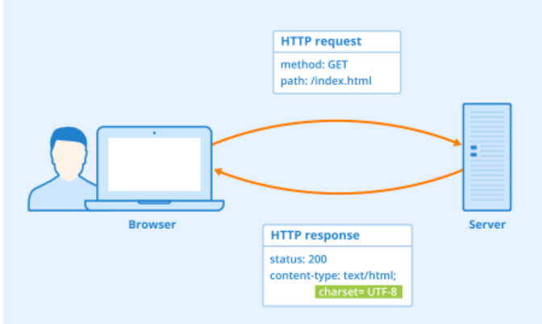
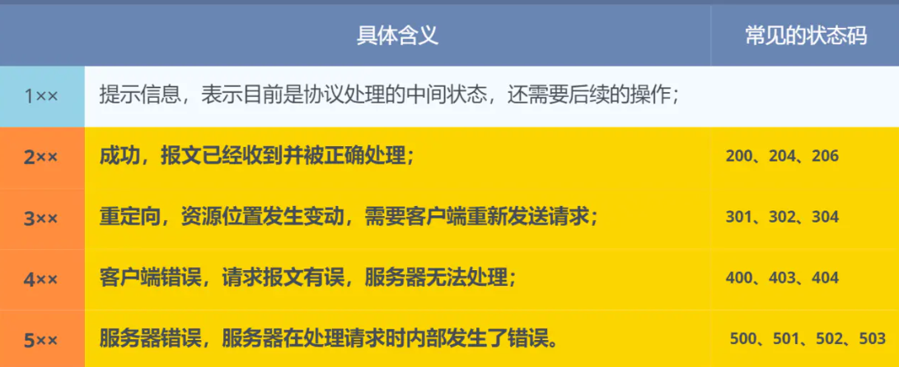

## 应用层

### HTTP 协议

HTTP 是超文本传输协议，也就是 HyperText Transfer Protocol

是一种用于传输超文本和多媒体内容的协议，主要是为 Web 浏览器与 Web 服务器之间的通信而设计的

当我们使用浏览器浏览网页的时候，我们网页就是通过 HTTP 请求进行加载的。

HTTP 使用客户端-服务器模型，客户端向服务器发送 HTTP Request（请求），服务器响应请求并返回 HTTP Response（响应）



HTTP 协议基于 TCP 协议，发送 HTTP 请求之前首先要建立 TCP 连接也就是要经历 3 次握手

目前使用的 HTTP 协议大部分都是 1.1。在 1.1 的协议里面，默认是开启了 Keep-Alive 的，这样的话建立的连接就可以在多次请求中被复用了

另外， HTTP 协议是“无状态”的协议，它无法记录客户端用户的状态，一般我们都是通过 Session 来记录客户端用户的状态。

> HTTP 是一个在计算机世界里专门在「两点」之间「传输」文字、图片、音频、视频等「超文本」数据的「约定和规范」

#### 常见状态码



5大类：

`1xx` 类状态码属于**提示信息**，是协议处理中的一种中间状态，实际用到的比较少。

`2xx` 类状态码表示服务器**成功**处理了客户端的请求，也是我们最愿意看到的状态。

- 「**200 OK**」是最常见的成功状态码，表示一切正常。如果是非 `HEAD` 请求，服务器返回的响应头都会有 body 数据。
- 「**204 No Content**」也是常见的成功状态码，与 200 OK 基本相同，但响应头没有 body 数据。
- 「**206 Partial Content**」是应用于 HTTP 分块下载或断点续传，表示响应返回的 body 数据并不是资源的全部，而是其中的一部分，也是服务器处理成功的状态。

`3xx` 类状态码表示客户端请求的资源发生了变动，需要客户端用新的 URL 重新发送请求获取资源，也就是**重定向**。

- 「**301 Moved Permanently**」表示永久重定向，说明请求的资源已经不存在了，需改用新的 URL 再次访问。
- 「**302 Found**」表示临时重定向，说明请求的资源还在，但暂时需要用另一个 URL 来访问。

301 和 302 都会在响应头里使用字段 `Location`，指明后续要跳转的 URL，浏览器会自动重定向新的 URL。

- 「**304 Not Modified**」不具有跳转的含义，表示资源未修改，重定向已存在的缓冲文件，也称缓存重定向，也就是告诉客户端可以继续使用缓存资源，用于缓存控制。
  - 我不给你文件，你本地的就是最新的，继续用吧

`4xx` 类状态码表示客户端发送的**报文有误**，服务器无法处理，也就是错误码的含义。

- 「**400 Bad Request**」表示客户端请求的报文有错误，但只是个笼统的错误。
- 「**403 Forbidden**」表示服务器禁止访问资源，并不是客户端的请求出错。
- 「**404 Not Found**」表示请求的资源在服务器上不存在或未找到，所以无法提供给客户端。

`5xx` 类状态码表示客户端请求报文正确，但是**服务器处理时内部发生了错误**，属于服务器端的错误码。

- 「**500 Internal Server Error**」与 400 类型，是个笼统通用的错误码，服务器发生了什么错误，我们并不知道。
- 「**501 Not Implemented**」表示客户端请求的功能还不支持，类似“即将开业，敬请期待”的意思。
- 「**502 Bad Gateway**」通常是服务器作为网关或代理时返回的错误码，表示服务器自身工作正常，访问后端服务器发生了错误。
- 「**503 Service Unavailable**」表示服务器当前很忙，暂时无法响应客户端，类似“网络服务正忙，请稍后重试”的意思

502出现时：

- Nginx（网关）自己工作正常 ✓
- 但Nginx去访问后端服务器失败了 ✗

##### 总结

| 状态码 | 记忆方法 | 含义 |
| --- | --- | --- |
| **1xx** | "等等" | 处理中，很少用 |
| **2xx** | "✓ 好！" | 成功（200最常见） |
| **3xx** | "挪地方" | 重定向（301/302跳转，304用缓存） |
| **4xx** | "你错了" | 客户端出错（你的请求有问题） |
| **5xx** | "我错了" | 服务器出错（服务器有问题） |

```
200 ✓ 一切正常
204 ✓ 成功但无内容
301 → 永久跳转（改网址了）
302 → 临时跳转（暂时换个网址）
404 ✗ 找不到这个资源
500 ✗ 服务器内部炸了
```

#### 常见字段

```
请求必备：Host, User-Agent, Content-Type
响应必备：Content-Type, Content-Length, Set-Cookie
缓存相关：Cache-Control, Last-Modified, ETag, 304
跳转相关：Location（301/302）
认证相关：Authorization, Cookie, Set-Cookie
```

##### **请求头（Request Headers）**

| 字段 | 含义 | 例子 |
| --- | --- | --- |
| **Host** | 请求的目标服务器地址 | `Host: www.example.com` |
| **User-Agent** | 客户端浏览器/应用信息 | `User-Agent: Mozilla/5.0...` |
| **Referer** | 来源页面URL | `Referer: https://google.com` |
| **Cookie** | 客户端存储的会话信息 | `Cookie: session=abc123` |
| **Content-Type** | 请求体的数据格式 | `Content-Type: application/json` |
| **Content-Length** | 请求体的字节数 | `Content-Length: 256` |
| **Accept** | 客户端能接受的数据格式 | `Accept: application/json` |
| **Authorization** | 身份验证令牌 | `Authorization: Bearer token123` |
| **Connection** | 连接控制 | `Connection: keep-alive` |

##### **响应头（Response Headers）**

| 字段 | 含义 | 例子 |
| --- | --- | --- |
| **Content-Type** | 响应体的数据格式 | `Content-Type: text/html; charset=utf-8` |
| **Content-Length** | 响应体的字节数 | `Content-Length: 1024` |
| **Set-Cookie** | 服务器设置的会话信息 | `Set-Cookie: session=abc123; Path=/` |
| **Location** | 重定向的目标URL（3xx用） | `Location: https://example.com/new` |
| **Cache-Control** | 缓存控制策略 | `Cache-Control: max-age=3600` |
| **Last-Modified** | 资源最后修改时间 | `Last-Modified: Mon, 23 May 2022` |
| **ETag** | 资源的唯一标识（用于304比对） | `ETag: "33a64df551425fcc55e4d42a148795d9f25f89d4"` |
| **Server** | 服务器软件信息 | `Server: Apache/2.4.1` |
| **Access-Control-Allow-Origin** | 跨域访问控制 | `Access-Control-Allow-Origin: *` |

##### Host

客户端发送请求时，用来指定服务器的域名

##### Content-Length 字段

服务器在返回数据时，会有 `Content-Length` 字段，表明本次回应的数据长度

告诉浏览器，本次服务器回应的数据长度是 1000 个字节，后面的字节就属于下一个回应了

HTTP 是基于 TCP 传输协议进行通信的，而使用了 TCP 传输协议，就会存在一个“粘包”的问题

HTTP 协议通过设置回车符、换行符作为 HTTP header 的边界

通过 Content-Length 字段作为 HTTP body 的边界，这两个方式都是为了解决“粘包”的问题

##### Connection 字段

Connection 字段最常用于客户端要求服务器使用「HTTP 长连接」机制，以便其他请求复用

HTTP 长连接的特点是，只要任意一端没有明确提出断开连接，则保持 TCP 连接状态

HTTP/1.1 版本的默认连接都是长连接，但为了兼容老版本的 HTTP，需要指定 `Connection` 首部字段的值为 `Keep-Alive`。

`Connection: Keep-Alive`

开启了 HTTP Keep-Alive 机制后， 连接就不会中断，而是保持连接。当客户端发送另一个请求时，它会使用同一个连接，一直持续到客户端或服务器端提出断开连接

##### Content-Type 字段

Content-Type 字段用于服务器回应时，告诉客户端，本次数据是什么格式

```
Content-Type: text/html; Charset=utf-8
```

上面的类型表明，发送的是网页，而且编码是UTF-8

客户端请求的时候，可以使用 `Accept` 字段声明自己可以接受哪些数据格式

`Accept: */*`

上面代码中，客户端声明自己可以接受任何格式的数据

##### Content-Encoding 字段

`Content-Encoding` 字段说明数据的压缩方法。表示服务器返回的数据使用了什么压缩格式

`Content-Encoding: gzip`

上面表示服务器返回的数据采用了 gzip 方式压缩，告知客户端需要用此方式解压。

客户端在请求时，用 `Accept-Encoding` 字段说明自己可以接受哪些压缩方法。

`Accept-Encoding: gzip, deflate`

#### GET 和 POST 区别

```
GET用于：
- 获取数据（查询参数）
- 例：/search?keyword=java&page=1
- 例：/user/123

POST用于：
- 提交表单数据
- 上传文件
- 修改/删除资源
- 例：注册账号、发表评论、删除订单
```

根据 RFC 规范，GET 的语义是**从服务器获取指定的资源**，这个资源可以是静态的文本、页面、图片视频等

GET 请求的**参数位置一般是写在 URL 中**，URL 规定只能支持 ASCII，所以 GET 请求的参数只允许 ASCII 字符 ，而且浏览器会对 URL 的长度有限制（HTTP协议本身对 URL长度并没有做任何规定）

根据 RFC 规范，**POST 的语义是根据请求负荷（报文body）对指定的资源做出处理**，具体的处理方式视资源类型而不同

POST 请求携带数据的位置一般是写在报文 body 中，body 中的数据可以是任意格式的数据，只要客户端与服务端协商好即可，而且浏览器不会对 body 大小做限制。

- **GET 方法就是安全且幂等的**，因为它是「只读」操作，无论操作多少次，服务器上的数据都是安全的，且每次的结果都是相同的。所以，**可以对 GET 请求的数据做缓存，这个缓存可以做到浏览器本身上（彻底避免浏览器发请求），也可以做到代理上（如nginx），而且在浏览器中 GET 请求可以保存为书签**。
- **POST** 因为是「新增或提交数据」的操作，会修改服务器上的资源，所以是**不安全**的，且多次提交数据就会创建多个资源，所以**不是幂等**的。所以，**浏览器一般不会缓存 POST 请求，也不能把 POST 请求保存为书签**。
