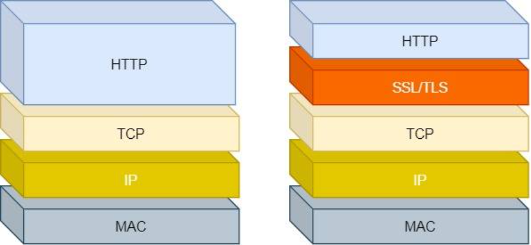
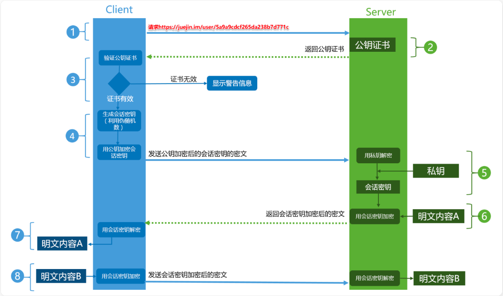

## 应用层

### HTTP 与 HTTPS

#### 两者区别

- HTTP 是超文本传输协议，信息是**明文传输**，存在安全风险的问题。HTTPS 则解决 HTTP 不安全的缺陷，在 TCP 和 HTTP 网络层之间加入了 SSL/TLS 安全协议，使得报文能够加密传输。
- HTTP 连接建立相对简单， TCP 三次握手之后便可进行 HTTP 的报文传输。而 HTTPS 在 TCP 三次握手之后，**还需进行 SSL/TLS 的握手过程**，才可进入加密报文传输。
- 两者的默认端口不一样，HTTP 默认端口号是 80，HTTPS 默认端口号是 443。
- HTTPS 协议需要向 CA（证书权威机构）申请数字证书，来保证服务器的身份是可信的

#### HTTPS 的优势

HTTP 由于是明文传输，所以安全上存在以下三个风险：

- 窃听风险，比如通信链路上可以获取通信内容，用户号容易没。
- 篡改风险，比如强制植入垃圾广告，视觉污染，用户眼容易瞎。
- 冒充风险，比如冒充淘宝网站，用户钱容易没。



HTTP**S** 在 HTTP 与 TCP 层之间加入了 `SSL/TLS` 协议，可以很好的解决了上述的风险：

- **信息加密**：交互信息无法被窃取。
- **校验机制**：无法篡改通信内容，篡改了就不能正常显示。
- **身份证书**：证明发消息的是真的发消息的

> HTTPS 是如何解决上面的三个风险的？

- **混合加密**的方式实现信息的**机密性**，解决了窃听的风险。
- **摘要算法**的方式来实现**完整性**，它能够为数据生成独一无二的「指纹」，指纹用于校验数据的完整性，解决了篡改的风险。
- 将服务器公钥放入到**数字证书**中，解决了冒充的风险

#### HTTPS 工作原理

HTTPS 协议会对传输的数据进行加密，而加密过程是使用了非对称加密实现

HTTPS 的整体过程分为**证书验证**和**数据传输**阶段，具体的交互过程如下：



- Client 发起一个 HTTPS 的请求
- Server 把事先配置好的公钥证书返回给客户端
- Client 验证公钥证书：比如是否在有效期内，证书的用途是不是匹配 Client 请求的站点，是不是在 CRL 吊销列表里面，它的上一级证书是否有效，这是一个递归的过程，直到验证到根证书（操作系统内置的 Root 证书或者 Client 内置的 Root 证书），如果验证通过则继续，不通过则显示警告信息
- Client 使用伪随机数生成器生成加密所使用的对称密钥，然后**用证书的公钥加密这个对称密钥**，发给 Server
- Server 使用自己的**私钥解密这个消息**，**得到对称密钥**。至此，Client 和 Server 双方都持有了相同的对称密钥
- Server 使用对称密钥加密明文内容 A，发送给 Client
- Client 使用对称密钥解密响应的密文，得到明文内容 A
- Client 再次发起 HTTPS 的请求，使用对称密钥加密请求的明文内容 B，然后 Server 使用对称密钥解密密文，得到明文内容 B

##### 混合加密 (非对称 + 对称)

非对称加密保证秘密交互设计的私钥

对称加密基于该私钥进行内容传输

采用的是**对称加密**和**非对称加密**结合的「混合加密」方式：

- 在通信建立前采用**非对称加密**的方式交换「会话秘钥」，后续就不再使用非对称加密。
- 在通信过程中全部使用**对称加密**的「会话秘钥」的方式加密明文数据。

采用「混合加密」的方式的原因：

- **对称加密**只使用一个密钥，运算速度快，密钥必须保密，无法做到安全的密钥交换。
- **非对称加密**使用两个密钥：公钥和私钥，公钥可以任意分发而私钥保密，解决了密钥交换问题但速度慢

##### 摘要算法 + 数字签名

为了保证传输的内容不被篡改，我们需要对内容计算出一个「指纹」，然后同内容一起传输给对方。

对方收到后，先是对内容也计算出一个「指纹」，然后跟发送方发送的「指纹」做一个比较，如果「指纹」相同，说明内容没有被篡改，否则就可以判断出内容被篡改了

那么，在计算机里会用**摘要算法（哈希函数）**来计算出内容的哈希值，也就是内容的「指纹」，这个哈希值是唯一的，且无法通过哈希值推导出内容

通过哈希算法可以确保内容不会被篡改，**但是并不能保证「内容 + 哈希值」不会被中间人替换，因为这里缺少对客户端收到的消息是否来源于服务端的证明**

> 比如消息在某个路由器传输，内容被人全改了，并修改了对应的指纹，但接受的验证了也不知道

那为了避免这种情况，计算机里会用**非对称加密算法**来解决，共有两个密钥：

- 一个是公钥，这个是可以公开给所有人的；
- 一个是私钥，这个必须由本人管理，不可泄露。

这两个密钥可以**双向加解密**的，比如可以用公钥加密内容，然后用私钥解密，也可以用私钥加密内容，公钥解密内容。

流程的不同，意味着目的也不相同：

- **公钥加密，私钥解密**。这个目的是为了**保证内容传输的安全**，因为被公钥加密的内容，其他人是无法解密的，只有持有私钥的人，才能解密出实际的内容；
- **私钥加密，公钥解密**。这个目的是为了**保证消息不会被冒充**，因为私钥是不可泄露的，如果公钥能正常解密出私钥加密的内容，就能证明这个消息是来源于持有私钥身份的人发送的。

一般我们不会用非对称加密来加密实际的传输内容，因为非对称加密的计算比较耗费性能的。

所以非对称加密的用途主要在于**通过「私钥加密，公钥解密」的方式，来确认消息的身份**，我们常说的**数字签名算法**，就是用的是这种方式，不过私钥加密内容不是内容本身，而是**对内容的哈希值加密**

私钥是由服务端保管，然后服务端会向客户端颁发对应的公钥。如果客户端收到的信息，能被公钥解密，就说明该消息是由服务器发送的

**但这种方式存在一个致命漏洞：无法保证对方的真实身份**。比如你访问了个伪造网站，但你以为是真的，实际上是别人伪造的

黑客可以自己生成一对公私钥，然后用自己的私钥签名消息，你用黑客给的"公钥"一验...完全有效，但你根本没在和真实网站通信。

而你就把所有信息全部告诉了盗版网站

**关键问题是：如何确保你收到的"公钥"就是真的公钥，而不是黑客的公钥？**

##### 数字证书

这就需要借助第三方权威机构 CA （数字证书认证机构）。

CA 的作用是：用**自己的私钥**对服务器的公钥进行签名，生成**数字证书**。这样做的好处是：

- 服务器的公钥被 CA 签名了 → 你需要验证 CA 的签名
- 而 CA 的公钥是**操作系统和浏览器内置**的，是可信的
- 所以通过信任 CA，你就能间接地信任服务器的公钥

整个信任链就是：

```
你信任CA的公钥（内置）
    ↓
用CA的公钥验证服务器公钥的签名
    ↓
签名有效 = 这个公钥确实是服务器的
    ↓
现在你可以放心使用这个公钥了
```

通过数字证书的方式，解决了**冒充的风险**，保证了公钥的真实性。
