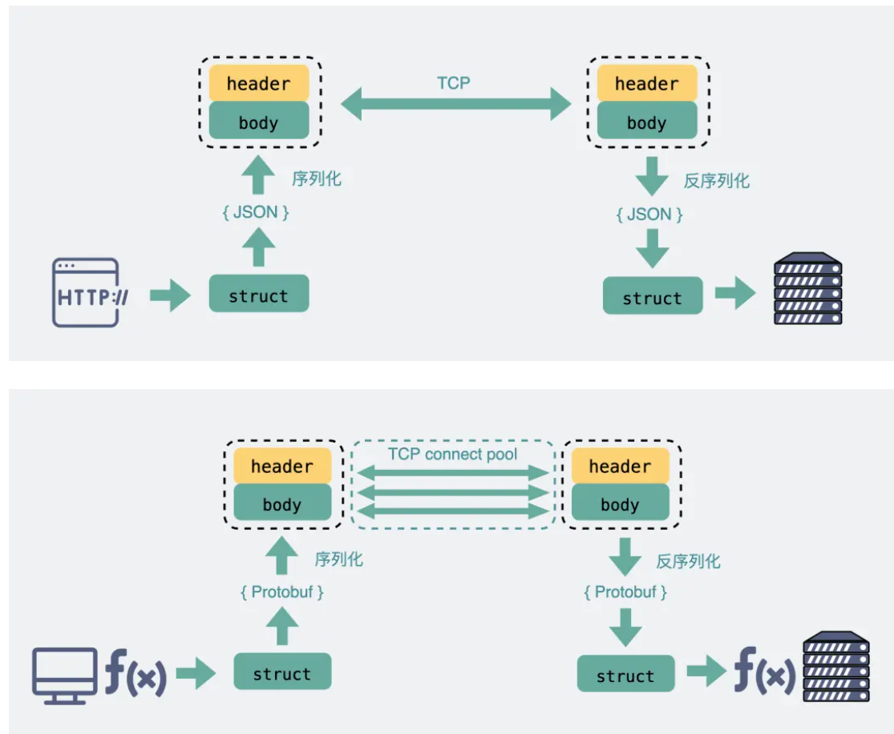

## 应用层

### RPC

RPC的本质：

屏蔽网络细节，让远程调用看起来像本地调用

#### 简洁理解

RPC是Remote Procedure Call的缩写，意思是在另一台电脑上调用函数。

在微服务架构中，服务之间需要互相调用。如果直接用HTTP，需要自己序列化参数、构造URL、解析响应，很麻烦。

RPC框架会自动处理这些细节，让你就像调用本地函数一样调用远程服务。比如你想调用服务B的某个方法，只需要：

```java
result = serviceB.add(1, 2)  // 就像本地调用一样简单
```

背后RPC框架会自动：

- 序列化参数
- 通过网络发送
- 在服务器上执行
- 返回结果

常见RPC框架有gRPC、Dubbo等，它们都是为了让服务间通信更高效、更方便。

**RPC**（Remote Procedure Call），即**远程过程调用**，是一种通过网络从远程计算机程序上请求服务，而不需要了解底层网络技术的协议。

通俗地说，RPC 的核心目标是：**让你调用远程服务器上的函数，就像调用本地函数一样简单。**

---

#### TCP 的不足

作为一个程序员，假设我们需要在 A 电脑的进程发一段数据到 B 电脑的进程，我们一般会在代码里使用 Socket 进行编程。

这时候，我们可选项一般也就 TCP 和 UDP 二选一。TCP 可靠，UDP 不可靠

光这样一个纯裸的 TCP 连接，就可以做到收发数据了，那是不是就够了？

不行，这么用会有问题

> TCP 是有三个特点，**面向连接**、**可靠**、基于**字节流**

字节流可以理解为一个双向的通道里流淌的数据，这个**数据**其实就是我们常说的二进制数据，简单来说就是一大堆 **01 串**

纯裸 TCP 收发的这些 01 串之间是**没有任何边界**的，你根本不知道到哪个地方才算一条完整消息

纯裸 TCP 是不能直接拿来用的，你需要在这个基础上加入一些**自定义的规则**，用于区分**消息边界**。

于是我们会把每条要发送的数据都包装一下，比如加入**消息头**，**消息头里写清楚一个完整的包长度是多少**，根据这个长度可以继续接收数据，截取出来后它们就是我们真正要传输的**消息体**

而这里头提到的**消息头**，还可以放各种东西，比如消息体是否被压缩过和消息体格式之类的，只要上下游都约定好了，互相都认就可以了，这就是所谓的**协议。**

每个使用 TCP 的项目都可能会定义一套类似这样的协议解析标准，他们可能**有区别，但原理都类似**。

**于是基于 TCP，就衍生了非常多的协议，比如 HTTP 和 RPC**

#### HTTP 和 RPC

**TCP 是传输层的协议**，而基于 TCP 造出来的 HTTP 和**各类** RPC 协议，它们都只是定义了不同消息格式的**应用层协议**而已

**HTTP** 协议（**H**yper **T**ext **T**ransfer **P**rotocol），又叫做**超文本传输协议**

我们用的比较多，平时上网在浏览器上敲个网址就能访问网页，这里用到的就是 HTTP 协议

而 **RPC**（**R**emote **P**rocedure **C**all），又叫做**远程过程调用**。它本身并不是一个具体的协议，而是一种**调用方式**

举个例子，我们平时调用一个**本地方法**就像下面这样。

```java
res = localFunc(req)
```

如果现在这不是个本地方法，而是个**远端服务器**暴露出来的一个方法 `remoteFunc`，如果我们还能像调用本地方法那样去调用它，这样就可以**屏蔽掉一些网络细节**，用起来更方便

```java
res = remoteFunc(req)
```

基于这个思路，大佬们造出了非常多款式的 RPC 协议，比如比较有名的`gRPC`，`thrift`。

值得注意的是，虽然大部分 RPC 协议底层使用 TCP，但实际上**它们不一定非得使用 TCP，改用 UDP 或者 HTTP，其实也可以做到类似的功能**

```
概念层（最高）：
RPC = 远程过程调用的思想/思路
      "能不能像调用本地函数一样调用远程函数？"

协议层（中间）：
如何实现这个思想？需要定义规则
- 怎么序列化参数？
- 怎么传输？
- 怎么反序列化返回值？
- 怎么处理错误？

框架/实现层（最低）：
具体的产品实现
- gRPC（Google的实现）
- Dubbo（阿里的实现）
- Thrift（Facebook的实现）
- Protobuf RPC（Protocol Buffers的）
```

> 既然有 HTTP 协议，为什么还要有 RPC？

其实，`TCP` 是**70年**代出来的协议，而 `HTTP` 是 **90 年代**才开始流行的。而直接使用裸 TCP 会有问题，可想而知，这中间这么多年有多少自定义的协议，而这里面就有**80年代**出来的 `RPC`。

所以我们该问的不是**既然有 HTTP 协议为什么要有 RPC**，而是**为什么有 RPC 还要有 HTTP 协议**。

> 那既然有 RPC 了，为什么还要有 HTTP 呢？

现在电脑上装的各种**联网**软件，比如 xx管家，xx卫士，它们都作为**客户端（Client）需要跟服务端（Server）建立连接收发消息**，此时都会用到应用层协议，在这种 Client/Server (C/S) 架构下，它们可以使用自家造的 RPC 协议，因为它只管连自己公司的服务器就 ok 了。

但有个软件不同，**浏览器（Browser）**，不管是 Chrome 还是 IE，它们不仅要能访问自家公司的**服务器（Server）**，还需要访问其他公司的网站服务器，因此它们需要有个统一的标准，不然大家没法交流。于是，HTTP 就是那个时代用于统一 **Browser/Server (B/S)** 的协议。

也就是说在多年以前，**HTTP 主要用于 B/S 架构，而 RPC 更多用于 C/S 架构。但现在其实已经没分那么清了，B/S 和 C/S 在慢慢融合。很多软件同时支持多端，比如某度云盘，既要支持网页版**，还要支持**手机端和 PC 端**，如果通信协议都用 HTTP 的话，那服务器只用同一套就够了。

而 RPC 就开始退居幕后，一般用于公司内部集群里，各个微服务之间的通讯

#### RPC vs. HTTP (REST)

很多初学者会问：“既然有了 HTTP，为什么还要用 RPC？”

| **特性** | **RPC** | **HTTP (RESTful)** |
| --- | --- | --- |
| **耦合性** | 强耦合（通常需要共享接口定义） | 松耦合（基于标准方法，如 GET/POST） |
| **性能** | **高**（二进制传输，报文小，长连接） | **中**（文本传输，报文头重） |
| **传输协议** | 通常是 TCP 或 HTTP/2 | HTTP/1.1 或 HTTP/2 |
| **适用场景** | **微服务内部通信**（内网、高性能） | **跨组织/前端调用**（公网、标准化） |

##### 服务发现

首先要向某个服务器发起请求，你得先建立连接，而建立连接的前提是，你得知道 **IP 地址和端口**。

这个找到服务对应的 IP 端口的过程，其实就是**服务发现**。

在 **HTTP** 中，你知道服务的域名，就可以通过 **DNS 服务**去解析得到它背后的 IP 地址，默认 80 端口。

而 **RPC** 的话，就有些区别，一般会有专门的**中间服务**去保存服务名和IP信息，比如 **Consul 或者 Etcd，甚至是 Redis**。想要访问某个服务，就去这些中间服务去获得 IP 和端口信息。由于 DNS 也是服务发现的一种，所以也有基于 DNS 去做服务发现的组件，比如**CoreDNS**

##### 传输的内容

基于 TCP 传输的消息，说到底，无非都是**消息头 Header 和消息体 Body。**

**Header** 是用于标记一些特殊信息，其中最重要的是**消息体长度**。

**Body** 则是放我们真正需要传输的内容，而这些内容只能是二进制 01 串，毕竟计算机只认识这玩意。

所以 TCP 传字符串和数字都问题不大，因为字符串可以转成编码再变成 01 串，而数字本身也能直接转为二进制。

但结构体呢，我们得想个办法将它也转为二进制 01 串，这样的方案现在也有很多现成的，比如 **Json，Protobuf。**

这个将结构体转为二进制数组的过程就叫**序列化**，反过来将二进制数组复原成结构体的过程叫**反序列化**

对于主流的 HTTP/1.1，虽然它现在叫**超文本**协议，支持音频视频，但 HTTP 设计初是用于做网页**文本**展示的，所以它传的内容以字符串为主。Header 和 Body 都是如此。在 Body 这块，它使用 **Json** 来**序列化**结构体数据。

可以看到这里面的内容非常多的**冗余**，显得**非常啰嗦**。最明显的，像 `Header` 里的那些信息，其实如果我们约定好头部的第几位是 Content-Type，就**不需要每次都真的把"Content-Type"这个字段都传过来**，类似的情况其实在 `body` 的 Json 结构里也特别明显。

而 RPC，因为它定制化程度更高，可以采用体积更小的 Protobuf 或其他序列化协议去保存结构体数据，同时也不需要像 HTTP 那样考虑各种浏览器行为，比如 302 重定向跳转啥的。**因此性能也会更好一些，这也是在公司内部微服务中抛弃 HTTP，选择使用 RPC 的最主要原因。**



#### RPC 的核心工作流程

在一个典型的 RPC 过程中，主要涉及以下几个角色和步骤：

1. **客户端 (Client)**：像调用本地方法一样发起调用。
2. **客户端存根 (Client Stub)**：负责将调用的方法名、参数等信息进行**序列化**（打包），并通过网络发送给服务端。
3. **网络传输**：通过 TCP 或 HTTP 等协议将数据包传输到远程服务器。
4. **服务端存根 (Server Stub)**：接收到数据包后进行**反序列化**（解包），找到对应的本地方法。
5. **服务端 (Server)**：执行实际的业务逻辑，并将结果返回给服务端存根。
6. **返回结果**：结果顺着原路返回，客户端最终拿到返回值。

---

#### RPC 的三大核心要素

要实现一个高性能的 RPC 框架，通常需要解决以下三个问题：

- **序列化 (Serialization)**：
由于网络只能传输二进制流，需要将对象转换为二进制（序列化），并在另一端还原（反序列化）。常见的方案有：**JSON**、**Protobuf**（gRPC 使用）、**Hessian**（Dubbo 常用）、**Kryo**。
- **通信协议 (Transport Protocol)**：
底层通常基于 **TCP** 或 **HTTP/2**（如 gRPC）。相比传统的 HTTP/1.1，RPC 框架通常会采用更紧凑的私有协议来减少报文体积，提升性能。
- **服务发现 (Service Discovery)**：
在分布式系统中，客户端需要知道服务端的 IP 和端口。通常引入**注册中心**（如 Zookeeper、Nacos、Consul）来动态管理服务列表。

---

#### 常见的 RPC 框架

在 Java 后端开发领域，你可能会经常接触到以下框架：

- **Dubbo**：阿里巴巴开源，在国内 Java 环境下应用极广，支持多种序列化协议，对服务治理支持很好。
- **gRPC**：Google 开源，基于 HTTP/2 和 Protobuf，跨语言能力极强（支持 Java, Go, Python, C++ 等）。
- **Thrift**：Facebook 开源，性能出色，同样支持多语言。
- **Spring Cloud OpenFeign**：虽然底层走的是 REST (HTTP)，但在使用体验上将其封装成了 RPC 的形式。

---

#### 为什么要用 RPC

在微服务架构中，一个业务逻辑可能需要调用几十个其他服务。

如果全部手写 HTTP 请求、处理 Headers、手动解析 JSON，开发效率会非常低。

RPC 框架通过**动态代理**技术隐藏了这些复杂性，让开发者可以专注于业务逻辑。

### gRPC 与 HTTP 分别有什么用？两者有什么区别

简单来说，**HTTP** 是互联网的“通用语言”，而 **gRPC** 是为了高性能微服务设计的“高速专线”。虽然 gRPC 底层也使用了 HTTP（HTTP/2），但两者的设计理念和应用场景有很大不同。

---

#### **1. 它们分别是做什么用的？**

##### HTTP (通常指 REST/JSON)

这是目前最流行的网络通信方式，主要用于：

- **浏览器与服务器通信**：你现在访问网页、刷社交媒体，底层基本都是 HTTP。
- **公共 API**：大多数公司提供的对外接口（如高德地图 API、GitHub API）都使用 HTTP/REST。
- **前后端分离**：前端应用（React/Vue）通过 HTTP 向后端请求 JSON 数据。

##### gRPC (Google Remote Procedure Call)

这是谷歌开发的一种高性能、开源的远程过程调用（RPC）框架，主要用于：

- **内部微服务通信**：大型系统内部上百个服务之间互通有无。
- **多语言环境**：后端服务可能用 Go 写，有的用 Java，gRPC 能让它们像调用本地代码一样通信。
- **实时数据流**：如股票行情监控、聊天应用等需要持续双向传输数据的场景。

---

#### **2. gRPC 与 HTTP (REST) 的核心区别**

| **特性** | **HTTP (REST)** | **gRPC** |
| --- | --- | --- |
| **传输协议** | 通常是 HTTP/1.1 或 HTTP/2 | 必须是 **HTTP/2** |
| **数据格式** | **JSON** (文本，易读但体积大) | **Protobuf** (二进制，极小且解析极快) |
| **设计模式** | 以**资源**为中心 (GET /users/1) | 以**方法**为中心 (GetUser()) |
| **性能** | 较低 (由于文本序列化和头部开销) | **极高** (由于二进制压缩和多路复用) |
| **流模式** | 主要是一问一答 (Request-Response) | 支持**双向流** (客户端服务端同时推数据) |
| **浏览器支持** | 原生支持 (所有浏览器通吃) | 需通过代理 (如 gRPC-Web) |
| **代码生成** | 需手动编写 API 客户端或使用第三方工具 | **自带强类型代码生成** (定义好 .proto 文件即可) |

#### 为什么 gRPC 往往比 HTTP 快？

1. **二进制 vs 文本**：
JSON 是字符串，解析它需要耗费较多 CPU；gRPC 使用 **Protobuf** 二进制格式，数据包更小，机器解析起来几乎是瞬间完成。
2. **HTTP/2 的加持**：
gRPC 强制使用 HTTP/2，这意味着它可以**多路复用**。在同一个连接上，它可以同时发送成百上千个请求，而不需要像 HTTP/1.1 那样排队。
3. **强类型约束**：
在 gRPC 中，你必须先定义一个 `.proto` 文件，明确字段类型。这避免了 JSON 经常出现的“字段名写错”或“类型不匹配”导致的低级错误。
