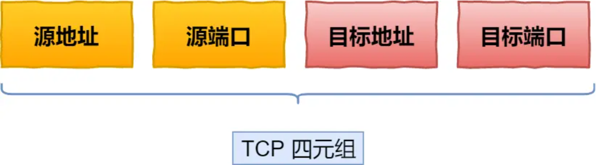
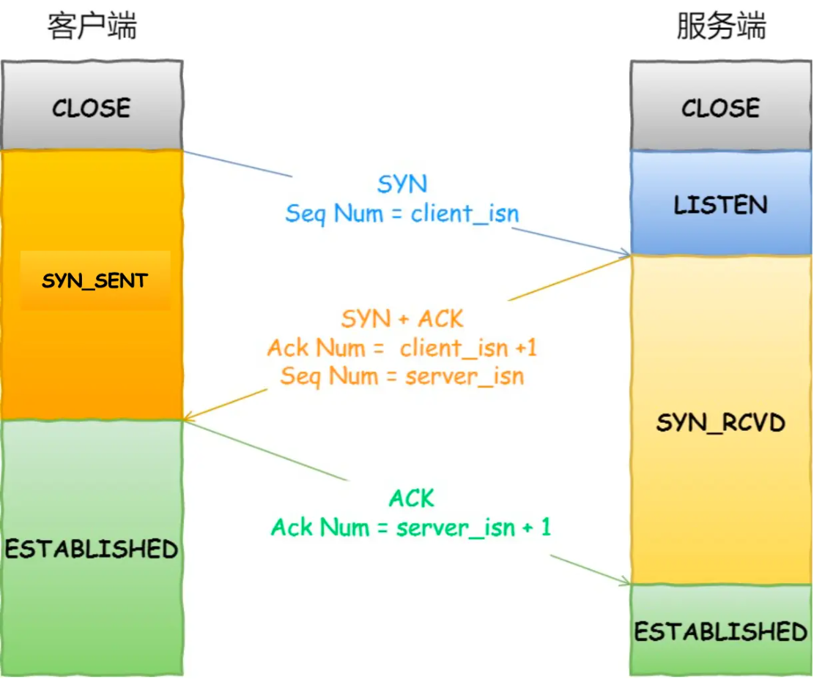
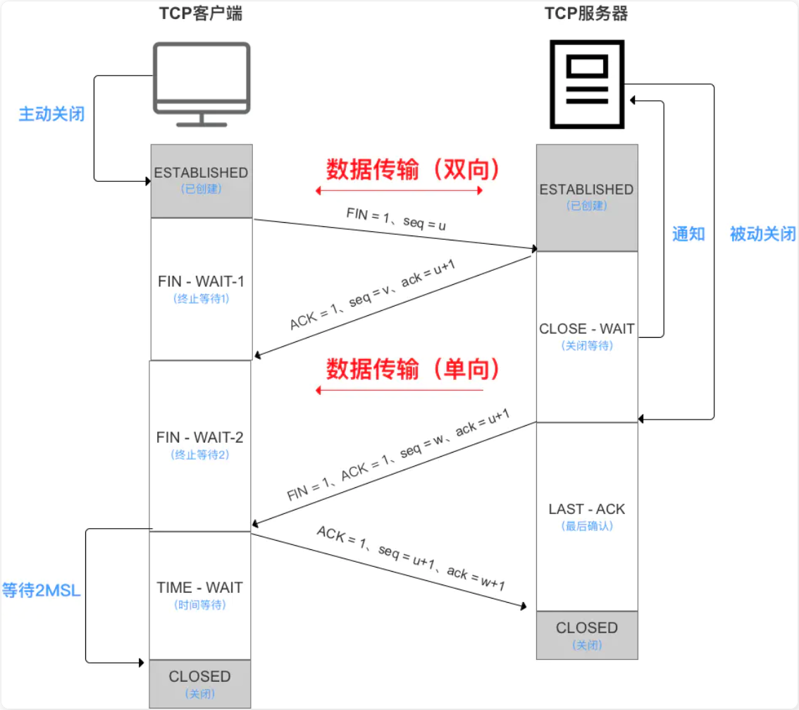

## 传输层

### TCP

TCP是一个传输层协议，提供可靠传输，支持全双工，是一个连接导向的协议

建立一个 TCP 连接是需要客户端与服务端达成上述三个信息的共识。

- **Socket**：由 IP 地址和端口号组成
- **序列号**：用来解决乱序问题等
- **窗口大小**：用来做流量控制

#### 双工/单工

在任何一个时刻，如果数据只能单向发送，就是单工。

如果在某个时刻数据可以向一个方向传输，也可以向另一个方向反方向传输，而且交替进行，叫作半双工；半双工需要至少 1 条线路。

如果任何时刻数据都可以双向收发，这就是全双工，全双工需要大于 1 条线路。

TCP 是一个双工协议，数据任何时候都可以双向传输。

这就意味着客户端和服务端可以平等地发送、接收信息

#### 主要特点

- TCP 是面向连接的运输层协议；所谓面向连接就是双方传输数据之前，必须先建立一条通道，例如三次握手就是建立通道的一个过程，而四次挥手则是结束销毁通道的一个其中过程。
- 每一条 TCP 连接只能有两个端点（即两个套接字），只能是点对点的；
- TCP 提供可靠的传输服务。传送的数据无差错、不丢失、不重复、按序到达；
- TCP 提供全双工通信。允许通信双方的应用进程在任何时候都可以发送数据，因为两端都设有发送缓存和接受缓存；
- 面向字节流。虽然应用程序与TCP交互是一次一个大小不等的数据块，但 TCP 把这些数据看成一连串无结构的字节流，它不保证接收方收到的数据块和发送方发送的数据块具有对应大小关系，例如，发送方应用程序交给发送方的TCP10个数据块，接收方的TCP可能只用收到的4个数据块字节流交付给上层的应用程序

#### 如何唯一确定一个 TCP 连接

TCP 四元组可以唯一的确定一个连接，四元组包括如下：

- 源地址
- 源端口
- 目的地址
- 目的端口

源地址和目的地址的字段（32 位）是在 IP 头部中，作用是通过 IP 协议发送报文给对方主机。

源端口和目的端口的字段（16 位）是在 TCP 头部中，作用是告诉 TCP 协议应该把报文发给哪个进程

#### TCP 头格式

**序列号**：在建立连接时由计算机生成的随机数作为其初始值，通过 SYN 包传给接收端主机，每发送一次数据，就「累加」一次该「数据字节数」的大小。**用来解决网络包乱序问题。**

**确认应答号**：指下一次「期望」收到的数据的序列号，发送端收到这个确认应答以后可以认为在这个序号以前的数据都已经被正常接收。**用来解决丢包的问题。**

**控制位：**

- *ACK*：该位为 `1` 时，「确认应答」的字段变为有效，TCP 规定除了最初建立连接时的 `SYN` 包之外该位必须设置为 `1` 。
- *RST*：该位为 `1` 时，表示 TCP 连接中出现异常必须强制断开连接。
- *SYN*：该位为 `1` 时，表示希望建立连接，并在其「序列号」的字段进行序列号初始值的设定。
- *FIN*：该位为 `1` 时，表示今后不会再有数据发送，希望断开连接。当通信结束希望断开连接时，通信双方的主机之间就可以相互交换 `FIN` 位为 1 的 TCP 段

### TCP 连接建立过程

- SYN表示"连接请求"
- ACK表示"确认/同意"
- FIN表示"关闭请求"

#### 三次握手

TCP 是面向连接的协议，所以使用 TCP 前必须先建立连接，而建立连接是通过三次握手来进行的

- 一开始，客户端和服务端都处于 `CLOSE` 状态。先是服务端主动监听某个端口，处于 `LISTEN` 状态
- 客户端会随机初始化序号（`client_isn`），将此序号置于 TCP 首部的「序号」字段中，同时把 `SYN` 标志位置为 `1`，表示 `SYN` 报文。
  - 接着把第一个 SYN 报文发送给服务端，表示向服务端发起连接，该报文不包含应用层数据，之后客户端处于 `SYN-SENT` 状态
- 服务端收到客户端的 `SYN` 报文后，首先服务端也随机初始化自己的序号（`server_isn`），将此序号填入 TCP 首部的「序号」字段中，其次把 TCP 首部的「确认应答号」字段填入 `client_isn + 1`, 接着把 `SYN` 和 `ACK` 标志位置为 `1`。最后把该报文发给客户端，该报文也不包含应用层数据，之后服务端处于 `SYN-RCVD` 状态
- 客户端收到服务端报文后，还要向服务端回应最后一个应答报文，首先该应答报文 TCP 首部 `ACK` 标志位置为 `1` ，其次「确认应答号」字段填入 `server_isn + 1` ，最后把报文发送给服务端，这次报文可以携带客户到服务端的数据，之后客户端处于 `ESTABLISHED` 状态。
- 服务端收到客户端的应答报文后，也进入 `ESTABLISHED` 状态

从上面的过程可以发现**第三次握手是可以携带数据的，前两次握手是不可以携带数据的**

一旦完成三次握手，双方都处于 ESTABLISHED 状态，此时连接就已建立完成，客户端和服务端就可以相互发送数据了

##### 面试记忆

TCP三次握手是建立连接的过程。

第一次：客户端发送SYN报文给服务器，告诉服务器要建立连接，客户端进入SYN-SENT状态。

第二次：服务器收到后回复SYN-ACK报文，表示同意建立连接，服务器进入SYN-RCVD状态。

第三次：客户端收到后再发送ACK报文进行确认，双方都进入ESTABLISHED状态，连接建立完成。

关键点：这样做能保证双方都知道对方能收发数据，序列号用于后续的数据传输和确认。第三次握手可以携带数据，提高效率。

> 第一次握手表示客户端可以发送且服务端可以接收
> 第二次握手表示服务器可以发送且用户端可以接收
> 第三次握手表示客户端同意互相发送数据 (此时可以发送)

##### 为什么三次握手而不是两次握手

- 第一，交换序列号。 三次握手是为了让双方都能告知和确认彼此的初始序列号，这是后续数据传输的基础。如果只握手两次，对方的序列号就无法被确认。
- 第二，防止旧连接请求。 因为网络延迟，客户端之前发送的SYN报文可能会在很久之后才到达服务器。如果只握手两次，服务器发出确认就建立连接了，但客户端并不知道，导致服务器白白浪费资源。采用三次握手，服务器需要等待客户端的第三次确认，如果客户端没有回应（说明这是个旧报文），服务器就会超时放弃，避免资源浪费。

> 如果只握手两次，服务器无法确认客户端是否真的收到了自己的信息，会造成资源浪费

假如`client`发出的第一个连接请求报文段并没有丢失，而是在某个网络结点长时间的滞留了，以致延误到连接释放以后的某个时间才到达`server`，本来这是一个早已失效的报文段，但`server`收到此失效的连接请求报文段后，就误认为是client再次发出的一个新的连接请求。

于是就向client发出确认报文段，同意建立连接，假设不采用**三次握手**，那么只要server发出确认，新的连接就建立了，由于现在client并没有发出建立连接的请求，因此不会理睬server的确认，也不会向server发送数据。

但server却以为新的连接已经建立，并一直等待`client`发来数据，这样，server的很多资源就白白浪费掉了。

采用**三次握手**的办法可以防止上述现象发生，例如刚才那种情况，client不会向`server`的确认发出确认，server由于收不到确认，就知道client并没有要求建立连接

#### 四次挥手

挥手请求可以是Client端，也可以是Server端发起的，我们假设是Client端发起：

- 第一次挥手： Client端发起挥手请求，向Server端发送标志位是FIN报文段，设置序列号seq，此时，Client端进入`FIN_WAIT_1`状态，这表示Client端没有数据要发送给Server端了。
- 第二次挥手：Server端收到了Client端发送的FIN报文段，向Client端返回一个标志位是ACK的报文段，ack设为seq加1，Client端进入`FIN_WAIT_2`状态，Server端告诉Client端，我确认并同意你的关闭请求。
- 第三次挥手： Server端向Client端发送标志位是FIN的报文段，请求关闭连接，同时Client端进入`LAST_ACK`状态。
- 第四次挥手 ： Client端收到Server端发送的FIN报文段，向Server端发送标志位是ACK的报文段，然后Client端进入`TIME_WAIT`状态，Server端收到Client端的ACK报文段以后，就关闭连接，此时，Client端等待2MSL的时间后依然没有收到回复，则证明Server端已正常关闭，那好，Client端也可以关闭连接了。

> 发出断开连接请求 (FIN + seq) -> 另一方收到并发送同意请求 (ACK + seq+1) -> 另一方通知可以断开连接 ->本地收到断开请求后会向另一方发送，另一方收到就断开了，本地则等待 2MSL 后就可以断开

| 步骤 | 发送方 | 接收方 | 含义 |
| --- | --- | --- | --- |
| ① | Client | Server | "我没数据了，要关闭" (FIN) |
| ② | Server | Client | "收到，同意" (ACK) |
| ③ | Server | Client | "我也没数据了，可以关闭了" (FIN) |
| ④ | Client | Server | "好的，再见" (ACK) + 等2MSL |

##### 简洁版

四次挥手就是TCP连接的关闭过程。

**第一次**：Client发送FIN报文，表示"我没数据了，要关闭连接"。

**第二次**：Server回复ACK，表示"我收到你的关闭请求了"。

**第三次**：Server再发送FIN报文，表示"我也准备好关闭了"。

**第四次**：Client回复ACK，然后进入TIME_WAIT状态，等待2MSL的时间。这样做是为了：

- 确保Server能收到这个ACK
- 让旧报文有足够时间消失，防止干扰新连接

等待完成后，Client才真正关闭连接。

##### 为什么连接的时候是三次握手，关闭的时候却是四次握手

**本质差异：状态的可控性**

**握手（3次）— 双方状态同步**

- Server收到Client的连接请求时，Server本身**立即就能判断是否准备好**
- 通常Server就是准备好的，所以可以同时回应两个信息：
  - "我收到了你的连接请求"（ACK）
  - "我也准备好建立连接了"（SYN）
- 这两个信息可以合并成一个SYN-ACK报文，所以是3次

**挥手（4次）— 双方状态异步**

- Client发送关闭请求后，Server收到时虽然能**立即确认收到**
- 但Server**不能立即判断是否准备好关闭**，因为：
  - 可能还有数据要发给Client
  - 可能还在处理业务逻辑
  - 需要时间清理资源
- 因此Server必须**分两步回应**：
  - 先发ACK：表示"我收到你的关闭请求了"
  - 再处理完所有事务后，发FIN：表示"我现在准备好关闭了"
- 所以是4次

**简单理解：握手时双方都在"待命状态"，马上就能启动；挥手时需要"收尾"，要等待对方把工作做完。**
